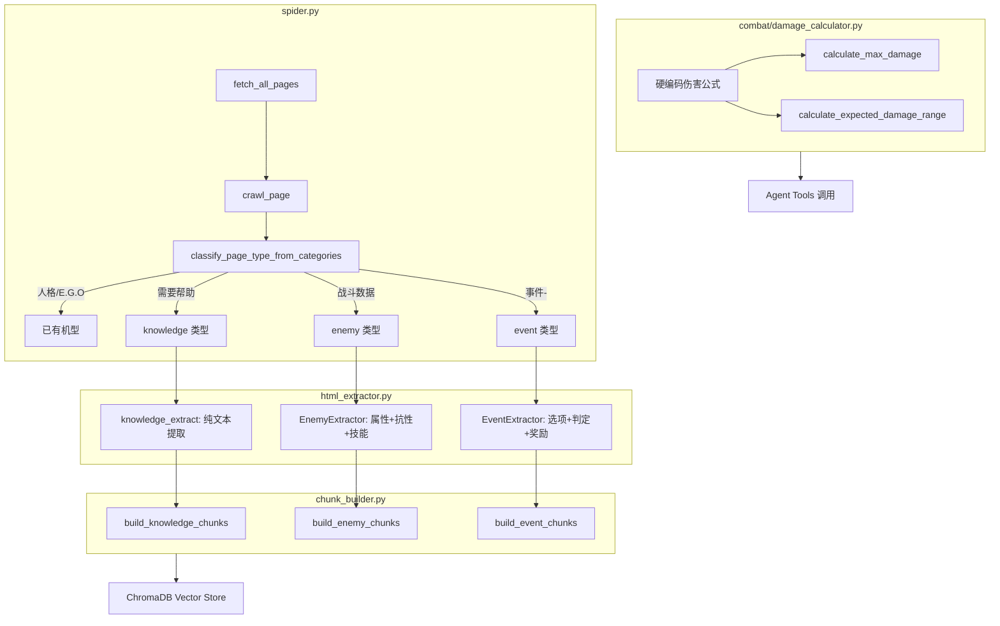
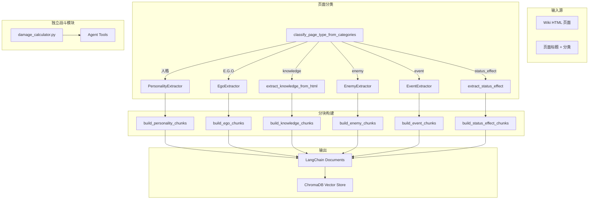

# 战斗机制记忆 + 敌人/事件提取 + 伤害计算 — 实施计划

## 概述

本文档涵盖重新爬取前的最后两项核心工作：
1. **战斗机制知识记忆**：5 个机制页面作为 `knowledge` 类型存入向量库
2. **敌人/事件提取**：新 page_type 的结构化提取管道
3. **伤害计算函数**：硬编码 Python 模块

---

## 源文件分析总结

| 文件 | 状态 | wgCategories | 关键发现 |
|------|------|-------------|----------|
| `基础数值` | **缺失** | `["需要帮助"]` | 仅有 `_files` 目录，需通过 spider 重新抓取 |
| `攻击抗性与类型` | 已有 | `["需要帮助"]` | 物理/罪孽抗性分级（致命/脆弱/一般/耐性/抵抗），罪孽碎片与共鸣机制 |
| `技能与拼点` | 已有 | `["需要帮助"]` | 技能基础、硬币类型、拼点机制、守备技能等 |
| `伤害计算` | 已有 | `["需要帮助"]` | 完整伤害公式（含两类乘算/加算增伤），用于硬编码实现 |
| `状态效果` | 已完成 | 无 | 已通过 `extract_status_effect_from_html()` 提取 |
| `主线战斗1-10` | 已有 | `["战斗数据","主线战斗"]` | 8 种敌方单位，属性+抗性+技能（CSS 定位卡片），boss 可有多技能 |
| `事件-膏血` | 已有 | `[]` | nav-pills 选项卡选项，判定成功/失败结果，E.G.O饰品奖励 |

---

## 架构设计



---

## 实施步骤

### 步骤 1：伤害计算模块 `combat/damage_calculator.py`

**新文件**，纯 Python 硬编码实现，不依赖 LLM。

#### 数据结构

```python
@dataclass
class SkillData:
    sin_type: str           # 暴怒/色欲/怠惰/暴食/忧郁/傲慢/嫉妒
    damage_type: str        # 斩击/突刺/打击
    base_value: int         # 基础值
    coin_power: int         # 硬币威力（变动值）
    coin_count: int         # 硬币数量
    attack_level: int       # 攻击等级
    attack_weight: int      # 攻击容量

@dataclass
class UnitState:
    hp: int
    defense_level: int      # 防御等级
    speed: int
    physical_resistances: dict[str, float]  # {"斩击": 1.0, "突刺": 0.75, "打击": 2.0}
    sin_resistances: dict[str, float]       # {"暴怒": 1.0, ...}
    active_buffs: list[BuffEffect]          # 第二类乘算/加算效果
    observation_level: int = 0

@dataclass
class DamageResult:
    min_damage: int
    max_damage: int
    expected_damage: float
    details: dict  # 各乘算因子明细
```

#### 核心公式（从 `伤害计算` HTML 提取）

```
总伤害 = 当前硬币造成的伤害 + 目标状态效果触发伤害 + 追加伤害
当前硬币造成的伤害 = 当前硬币数值 × 第一类乘算增伤 × 第二类乘算增伤 + 第一类加算增伤 + 第二类加算增伤
最低伤害 = max(1, floor(当前硬币数值 × 0.05))
```

**第一类乘算增伤组件**：
- 拼点胜利加成：每胜 1 次 +3%（仅对拼点技能）
- 暴击加成：暴击倍率 - 1（基础暴击倍率 1.2）
- 攻防等级差：(攻击等级 - 防御等级) × 计算系数（每差 3 级 ≈ +2.5%）
- 异想体观察等级加成：观察等级 × 0.03
- 物理/罪孽抗性增伤：抗性值 - 1（正值时有效，分为三段优先级）

**物理抗性值计算优先级**：
1. 混乱状态 2+：直接设为目标抗性（通常 ×2）
2. 抗性覆盖效果：直接设为目标抗性（-2 到 2）
3. 基础抗性 × (1 + 乘算加成) + 加算加成（clamp 到 -2~2）

**第二类乘算增伤**：状态效果/被动/场地/E.G.O饰品效果（叠加计算）

**追加伤害**：当前硬币造成的伤害 × 追加系数 × 抗性增伤

**期望伤害区间**：考虑硬币正反面概率 (50% + 理智 × 1%)

#### 公共函数

```python
def calculate_coin_power_range(base: int, coin_power: int, coin_count: int) -> tuple[int, int]:
    """计算硬币威力的最小/最大值区间"""
    
def calculate_physical_resistance(base: float, mult_bonus: float, 
                                   add_bonus: float, chaos_level: int = 0,
                                   override: Optional[float] = None) -> float:
    """计算物理抗性值（按照三级优先级）"""

def calculate_type1_multiplicative(clash_wins: int = 0, is_crit: bool = False,
                                     atk_def_diff: int = 0, observation_level: int = 0,
                                     resistance_bonus: float = 0) -> float:
    """计算第一类乘算增伤"""

def calculate_current_coin_damage(coin_value: int, type1_mult: float,
                                    type2_mult: float, type1_add: int,
                                    type2_add: int) -> int:
    """计算单个硬币造成的伤害"""

def calculate_max_damage(skill: SkillData, attacker: UnitState, 
                          defender: UnitState, clash_wins: int = 0,
                          sanity: int = 0) -> DamageResult:
    """计算某人格某技能在给定加成下的最大伤害"""
```

---

### 步骤 2：敌人提取 `html_extractor.py`

#### 新增 EnemyData 数据类

```python
@dataclass
class EnemyData:
    page_type: str = "enemy"
    title: str = ""
    enemy_name: str = ""           # 暴躁的残兵
    battle_stage: str = ""         # 主线战斗1-10
    hp: int = 0
    defense_level: int = 0
    speed_min: int = 0
    speed_max: int = 0
    physical_resistances: dict[str, float] = field(default_factory=dict)  # ×1.0 → 1.0
    sin_resistances: dict[str, float] = field(default_factory=dict)        # ×0.75 → 0.75
    panic_types: list[str] = field(default_factory=list)                    # ["无措", "无措"]
    passives: list[str] = field(default_factory=list)                       # 被动能力文本
    skills: list[dict] = field(default_factory=list)                        # 技能列表
```

#### 新增 EnemyExtractor 类

**提取逻辑**：

1. **定位敌人区域**：查找 `h4 span.mw-headline` 标签（如「暴躁的残兵」）
2. **基本信息表**（`table.wikitable` with `text-align: center;width:500px`）：
   - HP：`img[alt*="数值图标-生命"]` 后面的 `<b>` 文本
   - 防御：`img[alt*="数值图标-防御"]` 后面的 `<b>` 文本  
   - 速度：`img[alt*="数值图标-速度"]` 后面的 `<b>` 文本（如 "1-2"）
3. **物理抗性行**：
   - 三种物理图标 + `[×N]` 中的数值
4. **罪孽抗性行**：
   - 七种罪孽图标 + `[×N]` 中的数值
5. **恐慌类型行**：`恐慌类型：` 后的 tooltip 链接文本
6. **被动能力行**：文本内容或 "该敌人无被动能力"
7. **技能区域**（`mw-collapsible` → `table.wikitable[style*="width:100%"]`）：
   - **技能名称**：从 `<div class="textskill-container">` 的 `data-text` 属性或内部文本提取
   - **罪孽类型**：从 `img[alt*="罪孽-"]` 或 `img[alt*="色欲-等级"]` 的 alt 提取
   - **伤害类型**：从 `img[alt*="技能-"][alt*="斩击"]` 提取（如 "技能-斩击-色欲"）
   - **基础值**：绝对定位 div 中 `font-size: 1.8em` 的大号数字
   - **硬币威力**：`+N` 模式的绝对定位文本
   - **硬币数量**：`img[alt*="硬币"]` + `×N` 中的 N
   - **攻击等级**：`img[alt*="数值图标-攻击"]` 后面的数值
   - **攻击容量**：`攻击容量` 文本后面的数字

> **注意**：技能卡片使用游戏内 CSS 渲染（`position:absolute`, `clip-path`, `text-shadow`），需通过 DOM 定位而非纯文本匹配。

#### 敌人与人格的关键差异

| 特性 | 人格 (Personality) | 敌人 (Enemy) |
|------|-------------------|-------------|
| 语音 | ✅ 4 种语言语音 | ❌ 无 |
| 技能数量 | 通常 3（+1 守备） | 不限（boss 可达 6+） |
| 阶段系统 | I-IV 阶 + 强化 | 无阶段（仅一级） |
| sin_affinities | 3:2:1 比例 | 不使用 |
| E.G.O 资源 | ✅ | ❌ |
| 恐慌类型 | ❌ | ✅（士气低落/陷入恐慌） |
| 被动 | 战斗被动 + 支援被动 | 仅被动能力 |
| 所属 | 罪人 | 战斗关卡（主线战斗X-Y） |

---

### 步骤 3：事件提取 `html_extractor.py`

#### 新增 EventData 数据类

```python
@dataclass 
class EventOption:
    choice_text: str                           # "我喜欢。"
    check_requirements: list[dict] = field(default_factory=list)
    # [{"type": "有利判定", "sin": "色欲", "threshold": 8}]
    success_outcomes: list[str] = field(default_factory=list)
    # ["获得 经费 ×20", "获得 E.G.O饰品 XXX"]
    failure_outcomes: list[str] = field(default_factory=list)

@dataclass
class EventData:
    page_type: str = "event"
    title: str = ""              # 事件-膏血
    event_name: str = ""         # 膏血
    narration: str = ""          # 事件描述文本
    options: list[EventOption] = field(default_factory=list)
    ego_gifts: list[dict] = field(default_factory=list)
    # [{"name": "XXX", "effect": "..."}]
    related_abnormalities: list[str] = field(default_factory=list)
    trigger_location: str = ""
```

#### 新增 EventExtractor 类

**提取逻辑**：

1. **事件名称**：去除 "事件-" 前缀
2. **事件描述**：第一个 `div[style*="background:#000000"]` 内的叙述文本段落
3. **选项区**：
   - 定位 `<ul class="nav nav-pills">` → 每个 `<li>` 对应一个选项
   - 每个 `<div class="tab-pane">` 内容包含：
     - 选择文本：`<span class="label" style="background: #9A6433">` 内部文本
     - 判定需求：`有利判定` / `不利判定` 标签后的图标和阈值
     - 判定成功：`<span class="label" style="background: #67AD69">判定成功</span>` 后的列表
     - 判定失败：`<span class="label" style="background: #CD3532">判定失败</span>` 后的列表
4. **E.G.O饰品区**（可选）：
   - 标题 `E.G.O饰品` 下的 nav-tabs 表格
5. **相关异想体**（可选）
6. **事件触发地点**（可选）

---

### 步骤 4：机制知识页面

#### 分类逻辑

在 [`classify_page_type_from_categories()`](crawler/html_extractor.py:956) 中添加：

```python
# 机制知识页面（基础数值/攻击抗性/技能拼点/伤害计算）
_KNOWLEDGE_TITLES = {"基础数值", "攻击抗性与类型", "技能与拼点", "伤害计算"}

def classify_page_type_from_categories(categories, wikitext="", title=""):
    # ... 现有人格/EGO/剧情/状态效果判断 ...
    
    # 机制知识页面
    if title in _KNOWLEDGE_TITLES:
        return "knowledge"
    
    # 战斗数据 → 敌方单位
    if "战斗数据" in categories or "主线战斗" in categories:
        return "enemy"
    
    # 事件页面（标题以 "事件-" 开头且无明确分类）
    if title.startswith("事件-"):
        return "event"
    
    return None
```

#### 知识页面提取函数 `extract_knowledge_from_html()`

```python
def extract_knowledge_from_html(html: str, title: str, categories: list[str]) -> Optional[dict]:
    """提取机制知识页面为纯文本 dict。"""
    soup = BeautifulSoup(html, "lxml")
    content_div = soup.select_one("#mw-content-text .mw-parser-output")
    if not content_div:
        return None
    
    # 移除不需要的元素
    for tag in content_div.select("script, style, .mw-references-wrap, .category-links"):
        tag.decompose()
    
    text = content_div.get_text("\n", strip=True)
    # 清理多余空行
    text = re.sub(r"\n{3,}", "\n\n", text)
    
    return {
        "page_type": "knowledge",
        "title": title,
        "content": text,
        "categories": categories,
        "_structured": True,
    }
```

#### 分块构建 `build_knowledge_chunks()`

```python
def build_knowledge_chunks(data: dict) -> list[Document]:
    """将机制知识页面构建为 Document。"""
    title = data.get("title", "")
    content = data.get("content", "")
    
    # 单页整体记忆（内容通常在 2000-5000 字，适合一个 chunk）
    doc = Document(
        page_content=f"【{title}】\n\n{content}",
        metadata={
            "page_type": "knowledge",
            "title": title,
            "source": "wiki_mechanism",
        }
    )
    return [doc]
```

---

### 步骤 5：spider.py 集成

在 [`spider.py`](crawler/spider.py:23) 中：

```python
_STRUCTURED_PAGE_TYPES = {
    "personality", "ego", "story_note", "story_dialogue", 
    "status_effect", "knowledge", "enemy", "event"
}
```

在 [`TARGET_CATEGORIES`](crawler/spider.py:70) 中添加：
```python
TARGET_CATEGORIES = [
    "人格", "E.G.O", "罪人", "主线剧情", "异想体",
    "组织", "道具", "异常", "背景", "设定",
    "战斗数据", "主线战斗",  # 新增：敌方单位数据
]
```

在 [`extract_from_html()`](crawler/html_extractor.py:986) 中添加路由：
```python
elif page_type == "knowledge":
    return extract_knowledge_from_html(html, title, categories)
elif page_type == "enemy":
    extractor = EnemyExtractor(html, title, categories)
    return _enemy_to_dict(extractor.extract())
elif page_type == "event":
    extractor = EventExtractor(html, title, categories)
    return _event_to_dict(extractor.extract())
```

**注意**：敌人页面（`主线战斗X-Y`）也需要通过 `action=parse` 获取 HTML，因为 CSS 定位的技能卡片需要完整 DOM。现有的 [`crawl_page()`](crawler/spider.py:596) 中 `else` 分支（人格/EGO/状态效果）已经使用 `action=parse` 获取 HTML，需要将 enemy/event/knowledge 加入该分支。

当前 [`crawl_page()`](crawler/spider.py:580) 的逻辑：
- `story_dialogue` → WikiText 直接解析
- `story_note` → Playwright 渲染
- `else` (personality/ego/status_effect) → `action=parse` HTML

需要修改为将 knowledge/enemy/event 归入 `else` 分支（均使用 `action=parse`），或者：

> **更简洁的方案**：将 `_STRUCTURED_PAGE_TYPES` 分为两组：
> - `_WIKITEXT_TYPES = {"story_dialogue"}` → WikiText 直接解析
> - `_PLAYWRIGHT_TYPES = {"story_note"}` → Playwright 渲染
> - `_HTML_PARSE_TYPES = {"personality", "ego", "status_effect", "knowledge", "enemy", "event"}` → action=parse HTML

在 `crawl_page()` 中按此分组路由。

---

### 步骤 6：chunk_builder.py 集成

在 [`build_structured_chunks()`](crawler/chunk_builder.py:564) 中添加：

```python
elif page_type == "enemy":
    return build_enemy_chunks(data)
elif page_type == "event":
    return build_event_chunks(data)
elif page_type == "knowledge":
    return build_knowledge_chunks(data)
```

#### `build_enemy_chunks()` 设计

```python
def build_enemy_chunks(data: dict) -> list[Document]:
    """将敌方单位数据构建为 Document 列表。
    
    每个敌人一个基本信息块 + 每个技能一个块。
    """
    documents = []
    enemy_name = data.get("enemy_name", "")
    battle_stage = data.get("battle_stage", "")
    
    base_metadata = {
        "page_type": "enemy",
        "enemy_name": enemy_name,
        "battle_stage": battle_stage,
        "source": "wiki_structured",
    }
    
    # 1) 基本信息块
    info_lines = [f"敌方单位：{enemy_name}"]
    info_lines.append(f"所属关卡：{battle_stage}")
    info_lines.append(f"生命：{data.get('hp', '?')}")
    info_lines.append(f"防御等级：{data.get('defense_level', '?')}")
    info_lines.append(f"速度：{data.get('speed_min', '?')}-{data.get('speed_max', '?')}")
    info_lines.append(f"物理抗性：{_format_resistance_table(data.get('physical_resistances', {}))}")
    info_lines.append(f"罪孽抗性：{_format_resistance_table(data.get('sin_resistances', {}))}")
    # ... 恐慌类型、被动 ...
    
    # 2) 技能块（每个技能一个）
    for skill in data.get("skills", []):
        # ... 类似 personality skill chunk ...
    
    return documents
```

#### `build_event_chunks()` 设计

```python
def build_event_chunks(data: dict) -> list[Document]:
    """将探索事件数据构建为 Document 列表。"""
    # 一个事件一个 chunk，包含所有选项和结果
    lines = [f"探索事件：{data.get('event_name', '')}"]
    lines.append("")
    lines.append(data.get("narration", ""))
    
    for opt in data.get("options", []):
        lines.append(f"\n--- {opt['choice_text']} ---")
        # 判定条件
        # 成功结果
        # 失败结果
    
    doc = Document(page_content="\n".join(lines), metadata={...})
    return [doc]
```

---

### 步骤 7：缺失的「基础数值」HTML

`基础数值` HTML 文件缺失，仅有 `_files` 目录。两种处理方案：

**方案 A**（推荐）：在计划中记录此项为已知缺失，等 spider 重新运行时自动抓取。spider 已有 `TARGET_CATEGORIES` 中的 "机制" 相关分类，但如果 `基础数值` 不在爬取列表里，需要手动触发或通过 `fetch_all_pages()` 自动包含。

**方案 B**：要求用户手动提供该 HTML 文件。

建议在实现知识页面提取后，通过 spider 的 `fetch_all_pages()` 检查 `基础数值` 是否在 Wiki 的页面列表中。如果不在 `TARGET_CATEGORIES` 覆盖范围内，将其加入一个固定的知识页面抓取列表。

---

### 步骤 8：测试

在虚拟环境中运行：
```bash
venv\Scripts\python -m pytest tests/ -v
```

需要新增测试用例：
- `test_damage_calculator.py`：验证伤害计算模块各种场景
- 扩展现有 `test_html_extractor.py`：添加 enemy/event/knowledge 提取测试
- 使用 `主线战斗1-10.html` 和 `事件-膏血.html` 作为测试夹具

---

## 文件变更清单

| 文件 | 操作 | 说明 |
|------|------|------|
| `combat/__init__.py` | **新建** | 模块初始化 |
| `combat/damage_calculator.py` | **新建** | 硬编码伤害计算 |
| `crawler/html_extractor.py` | 修改 | +EnemyData, +EnemyExtractor, +EventData, +EventExtractor, +extract_knowledge_from_html, +路由扩展 |
| `crawler/chunk_builder.py` | 修改 | +build_enemy_chunks, +build_event_chunks, +build_knowledge_chunks, +路由扩展 |
| `crawler/spider.py` | 修改 | +_STRUCTURED_PAGE_TYPES, +TARGET_CATEGORIES, 路由分组优化 |
| `tests/test_damage_calculator.py` | **新建** | 伤害计算单元测试 |
| `tests/test_html_extractor.py` | 修改 | +enemy/event/knowledge 提取测试 |

---

## Mermaid 整体流程图



---

## 实施顺序建议

1. **先建模块**：`combat/damage_calculator.py`（独立，无外部依赖）
2. **扩展提取**：`html_extractor.py` 添加 knowledge/enemy/event 提取
3. **扩展分块**：`chunk_builder.py` 添加对应 builder
4. **集成路由**：`spider.py` 添加分类和路由
5. **编写测试**：验证所有新功能
6. **运行验证**：在虚拟环境中跑测试

---

## 已知风险

1. **敌人技能 CSS 解析**：技能卡片使用 game-style CSS 渲染，`data-text` 属性可能在某些 boss 页面中不存在，需准备回退策略（从 alt 属性或相邻文本推断）
2. **基础数值缺失**：HTML 不在 workspace 中，实现阶段先用其他机制页面测试 knowledge 流程的正确性，基础数值的具体内容通过 spider 重新抓取
3. **事件页面判定条件**：不同事件可能有不同格式的判定条件（有利判定/不利判定/无判定），需要灵活处理
4. **战斗数据页面可能包含多个敌人**：一个 `主线战斗X-Y` 页面通常包含 3-8 个敌人，提取器需要循环处理所有 h4 标题下的敌人
