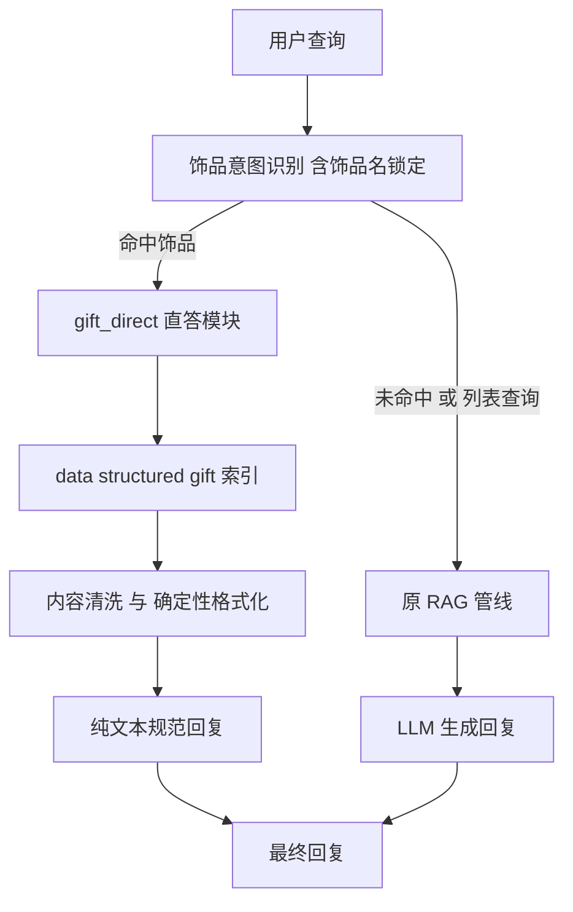

# E.G.O 饰品数据结构化直答方案（Gift Direct Answer）

## 一、问题背景

用户查询"月之记忆"无法命中饰品数据，根因（已排查确认）：
- 爬虫数据确实存在（`data/raw/wiki_accessories.jsonl` line 200 `gift_9083`），`content` 正是
  用户期望的"全体敌方单位（异想体则为所有部位）的物理抗性及罪孽抗性全部变为"致命"。"
- 但**检索侧 page_type 三处不一致**，导致饰品在检索链路全面失效：
  1. [`classify_intent`](rag/query_processor.py:515) 饰品意图返回 filter `{"page_type": "accessory"}`
  2. 饰品 chunk metadata 的 `page_type="ego_gift"`（[`build_gift_chunks`](crawler/chunk_builder.py:383)）
  3. [`_exhaustive_ego_lookup`](rag/retriever.py:311) 仅匹配 `page_type=="ego"`
- 用户决策：**"不用考虑检索逻辑，用与人格信息相同的检索方法，输出固定格式"**
  ——完全镜像已完成的人格结构化直答（Persona Direct Answer）架构，绕开向量检索，
  爬取时导出固定 JSON，运行时直接读取确定性返回。

## 二、设计决策

| 维度 | 决策 |
|------|------|
| 输出内容 | 饰品完整字段：名称 / 稀有度 / 获取地点 / 效果类型 / 罪孽属性 / 经费 / 效果文本 / 版本 / 特殊标注（合成/事件） |
| 数据源 | 爬取时生成独立 JSON 文件 `data/structured/gift_<id>.json`；运行时直读该目录 |
| 索引键 | **用 `id`（gift_xxxx）做文件名与主索引键**，规避 title 不唯一（怀表：Type L 出现 2 处） |
| 多版本 | 同 title 多 stage（base/upgraded_2/upgraded_3）合并为一个展示单元，全版本输出 |
| 输出形式 | 确定性纯文本规范格式，不经过 LLM（与人格直答一致） |

## 三、饰品数据现状（需处理的数据特征）

以 `data/raw/wiki_accessories.jsonl`（622 条）为例：

| 特征 | 说明 | 处理策略 |
|------|------|----------|
| title 不唯一 | 怀表：Type L 在 gift_2043（时间杀人时间）与 gift_9728（镜像迷宫）各一条 | 索引键用 id；格式化时按 title 聚合展示或标注 location 区分 |
| 多版本 | 血雾 gift_9090 有 base + upgraded_2 + upgraded_3 三条 | 同 title 聚合，逐版本列出效果 |
| content 残留 | 首行 `名字：[地点][效果类型]`、`镜牢经费.png：600`、`（未强化版）` 等 | 清洗：去 `镜牢经费.png：` 前缀，版本标注提取为字段 |
| 可选字段 | `special`（合成）、`event`（事件-xxx）、`cost`（经费） | 格式化时按存在与否展示 |

### 月之记忆字段样例（gift_9083）

```json
{
  "id": "gift_9083",
  "title": "月之记忆",
  "content": "月之记忆：[镜像迷宫][泛用]\n镜牢经费.png：600\n全体敌方单位（异想体则为所有部位）的物理抗性及罪孽抗性全部变为"致命"。\n（未强化版）",
  "page_type": "ego_gift",
  "gift_name": "月之记忆",
  "rarity": 5,
  "cost": "600",
  "effect_types": "泛用",
  "attack_type": "嫉妒",
  "location": "镜像迷宫",
  "stage": "base"
}
```

## 四、架构



### 数据流

1. **爬取阶段**：`_fetch_tabx_gifts` 产出饰品 dict → 除写 `wiki_accessories.jsonl` 外，
   **额外**写 `data/structured/gift_<id>.json`（按 id 唯一，天然规避 title 不唯一）
2. **运行时**：`gift_direct` 模块懒加载扫描 `data/structured/gift_*.json`，建立 `id → 数据` 索引
   + `title → id 列表` 反向索引（处理多版本/重名）
3. **查询**：饰品名提取 → 索引取数 → 内容清洗 → 确定性格式化 → 直接返回

## 五、实现步骤

### Step 1：数据层 —— 饰品结构化导出（crawler）

在 [`crawler/structured_exporter.py`](crawler/structured_exporter.py:150) 新增（不破坏人格导出）：

- `export_gift_record(record: dict)`：写 `data/structured/gift_<id>.json`
- `export_gift_records(records)`：批量导出（仅 `page_type == "ego_gift"`）
- `rebuild_gifts(input_jsonl="data/raw/wiki_accessories.jsonl")`：从饰品 jsonl 全量重建
- `load_gift_index(out_dir)`：扫描 `gift_*.json` → `{id: record}` + `{title: [id...]}` 双索引

**导出前内容清洗**（`_clean_gift_content(record)`）：
- 去除首行 `名字：[地点][效果类型]` 标签行（信息已拆分为字段）
- 去除 `镜牢经费.png：` 前缀，经费直接取 `cost` 字段
- 去除 `（未强化版）/（强化版·Ⅱ级）/（强化版·Ⅲ级）` 尾部标注（版本由 `stage` 字段表达）
- 保留效果正文（多行，如古代雕像的 3 行效果）

接入点（[`crawler/spider.py`](crawler/spider.py:165) `_fetch_tabx_gifts` 保存处）：
- 写 `wiki_accessories.jsonl` 后同步调用 `export_gift_records`
- 全量重建路径调用 `rebuild_gifts` 兜底

### Step 2：运行时模块 —— gift_direct

新建 `rag/gift_direct.py`（镜像 [`rag/persona_direct.py`](rag/persona_direct.py:306)）：

- `GiftDirectStore` 类：
  - `__init__(data_dir="data/structured", enabled=True)`：懒加载扫描
  - `reload()` / `get_gift(gift_id)` / `search(name_like)`
  - `find_by_title(title) -> list[record]`：按 title 返回全部版本记录（处理多版本/重名）
- `extract_gift_name(query)`：饰品名锁定（对齐人格的 `extract_personality_name`）——
  复用 `classify_intent` 的 accessory 意图 + 从 INTENT_RULES 提取饰品标题词表；
  优先支持精确饰品名 + 常用别名（如"月记"→"月之记忆"）
- `format_gift_full(records) -> str`：确定性格式化（多版本合并输出）：

```
【饰品】月之记忆
【稀有度】★★★★★（5）
【获取地点】镜像迷宫
【效果类型】泛用
【罪孽属性】嫉妒
【经费】600
【特殊】合成          ← 仅 special 存在时
【事件】事件-xxx      ← 仅 event 存在时
【效果（未强化）】
全体敌方单位（异想体则为所有部位）的物理抗性及罪孽抗性全部变为"致命"。
【效果（强化版·Ⅱ级）】  ← 存在 upgraded_2 时
...
```

- `try_direct_answer(query) -> Optional[str]`：
  1. `classify_intent` → `is_listing` 为 True → None（"有哪些流血饰品"不直答，回落 RAG 列表检索）
  2. `extract_gift_name` 锁定具体饰品名 → `find_by_title` 取全版本 → 清洗+格式化 → 返回
  3. 未命中 → None（回落 RAG）
- 独立验证入口：`python -m rag.gift_direct "月之记忆"`

### Step 3：接入 agent 主流程

[`agent/core.py`](agent/core.py:33)：
- `__init__` 新增 `self.gift_direct = None`（与 `persona_direct` 并列）
- `initialize_rag` 中按 `config.agent.gift_direct` 初始化 `GiftDirectStore`
- [`_generate_reply`](agent/core.py:316) 中，在 `persona_direct` 之后、RAG 之前：
  `direct = self.gift_direct.try_direct_answer(msg.text)` → 命中直接 return

### Step 4：配置开关

[`config.yaml`](config.yaml) `agent` 下新增（与 persona_direct 并列）：

```yaml
  gift_direct:
    enabled: true
    data_dir: "data/structured"
```

### Step 5：验证

新建 `diag_gift_direct_verify.py`：
1. "月之记忆" → 直答命中，输出含"全体敌方单位（异想体则为所有部位）的物理抗性及罪孽抗性全部变为"致命""的规范文本
2. 多版本饰品（"血雾"/"镇魂"）→ 输出 base + 强化版全部效果
3. 重名饰品（"怀表：Type L"）→ 按 title 聚合，多 location 区分展示
4. 非饰品查询（"8-33-06 剧情"）→ 返回 None，回落 RAG 生效
5. 列表查询（"有哪些流血饰品"）→ 不直答，回落 RAG
6. 缺失饰品名 → 回落 RAG
7. 输出直答结果到文件供确认

## 六、边界与注意事项

1. **gift 与 persona 目录共用** `data/structured/`：用 `gift_*.json` vs `persona_*.json` 文件名前缀区分，互不干扰
2. **重名/多版本策略**：格式化时按 title 聚合全版本；若用户只问效果不问版本，默认展示全部版本并标注
3. **content 清洗规则**：严格保留效果正文语义，仅去除解析标签残留（`镜牢经费.png：` / 首行标签 / 尾部版本标注）
4. **直答确定性**：绕过 LLM，固定格式无幻觉；与人格直答、RAG 三者并行互不冲突
5. **schema 兼容**：`gift_*.json` 为派生产物，重爬后整体重建；目录为空则直答自动失效回落 RAG
6. **不纳入 git**：`data/structured/gift_*.json` 属于构建产物
7. **后续扩展**：状态效果、敌方单位可复用同一 GiftDirectStore 模板（用户后续规定格式）

## 七、交付物清单

| 文件 | 类型 | 说明 |
|------|------|------|
| `crawler/structured_exporter.py` | 修改 | 新增 gift 导出 + 内容清洗 + rebuild_gifts |
| `crawler/spider.py` | 修改 | `_fetch_tabx_gifts` 保存处接入导出 |
| `rag/gift_direct.py` | 新增 | 直答存储 + 饰品名提取 + 确定性格式化 + 入口 |
| `agent/core.py` | 修改 | gift_direct 直答优先接入 |
| `config.yaml` | 修改 | gift_direct 开关 |
| `diag_gift_direct_verify.py` | 新增 | 直答验证脚本 |
