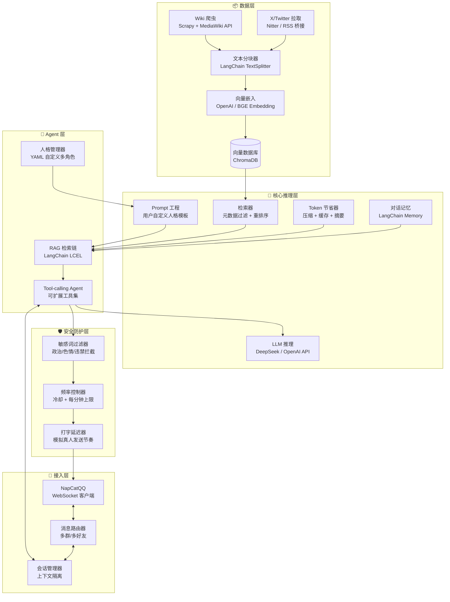
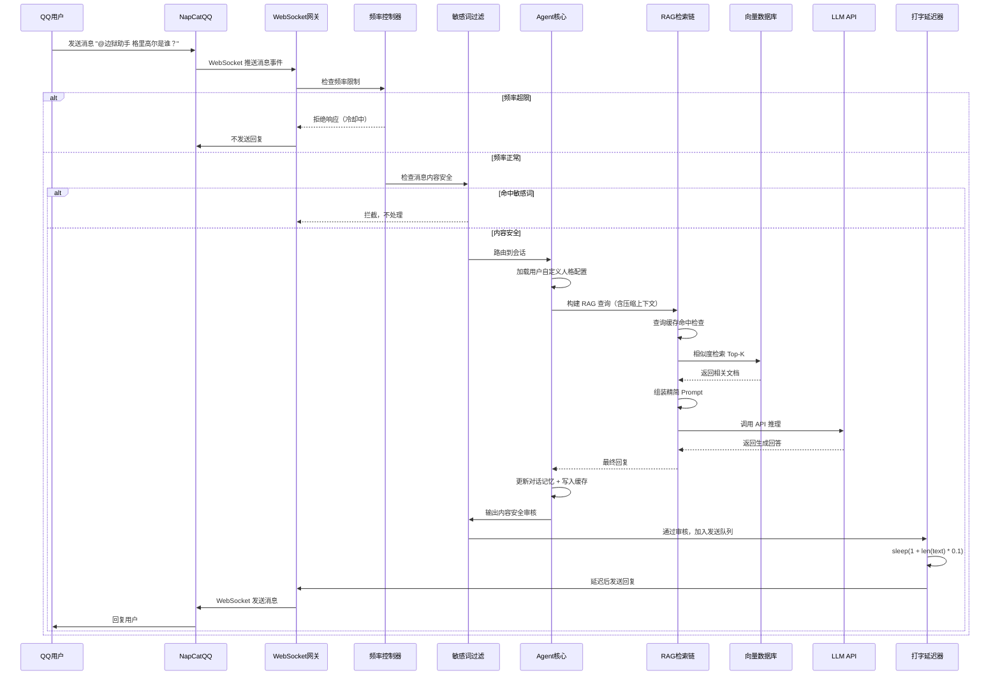
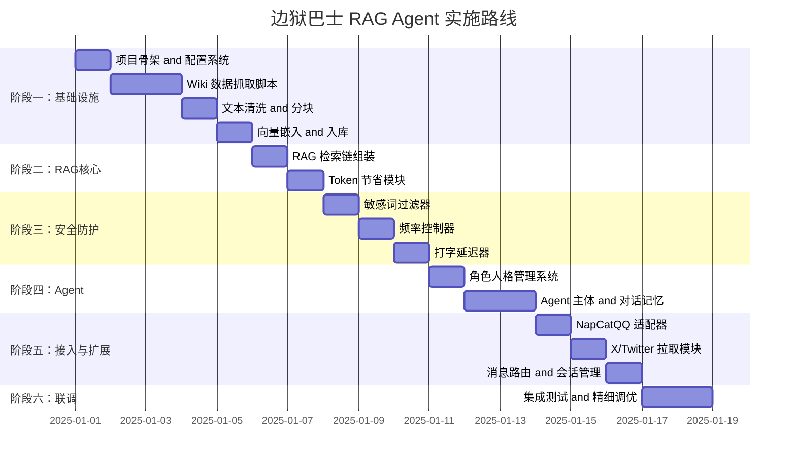

# 边狱巴士 RAG Agent 设计方案

> **项目定位**：基于 LangChain 构建一个融合边狱巴士 Wiki 知识库的 RAG 智能体，以用户自定义的角色人格与用户进行 QQ 聊天交流，同时拉取官方 X/Twitter 资讯。内置 Token 节省、频率控制、打字延迟、敏感词过滤等安全防护机制。

---

## 一、整体架构



---

## 二、数据流全景（含安全链）



---

## 三、详细模块设计

### 3.1 Wiki 数据抓取模块 (`crawler/`)

**数据源**：[`limbuscompany.huijiwiki.com`](https://limbuscompany.huijiwiki.com/wiki)

**目标页面类型**（全面抓取）：

| 分类 | Wiki路径 | 说明 |
|------|----------|------|
| 人格（Identity） | `/wiki/人格` | 各角色人格属性、技能、台词 |
| E.G.O | `/wiki/E.G.O` | 侵蚀武器数据、背景故事 |
| 罪人（Sinner） | `/wiki/罪人` | 12名罪人档案、背景 |
| 剧情 | `/wiki/主线剧情` | 章节剧情文本 |
| 异想体 | `/wiki/异想体` | 异常体设定 |
| 组织 | `/wiki/组织` | 世界组织设定 |
| 道具 | `/wiki/道具` | 物品说明 |
| 异常 | `/wiki/异常` | 状态效果 |

**技术方案**：
- **爬虫框架**：[`Crawl4AI`](https://github.com/unclecode/crawl4ai) 或 [`Scrapy`](https://scrapy.org) + [`Playwright`](https://playwright.dev)
  - 灰机 Wiki 使用 MediaWiki 引擎，可直接通过 `?action=raw` 获取原始 WikiText
  - 或使用 MediaWiki API (`/api.php`) 批量导出
- **策略**：
  1. 先获取[`特殊:所有页面`](https://limbuscompany.huijiwiki.com/wiki/Special:%E6%89%80%E6%9C%89%E9%A1%B5%E9%9D%A2)列表
  2. 过滤掉模板/分类/文件/用户等非内容页面
  3. 批量下载 WikiText → 转换为纯文本 Markdown
  4. 保留页面标题、分类标签作为元数据

**输出格式**：
```json
{
  "id": "wiki_identity_格里高尔_良秀_良派",
  "title": "格里高尔·良秀·良派",
  "url": "https://limbuscompany.huijiwiki.com/wiki/格里高尔·良秀·良派",
  "categories": ["人格", "格里高尔", "3星"],
  "content": "...清理后的Markdown文本...",
  "last_modified": "2024-12-01T00:00:00Z"
}
```

---

### 3.2 文本分块与向量化模块 (`rag/`)

**分块策略**（LangChain Text Splitters）：

```python
from langchain.text_splitter import RecursiveCharacterTextSplitter

# 主分块器：按语义边界切割
splitter = RecursiveCharacterTextSplitter(
    chunk_size=512,        # 每块 512 字符（中文约 256 token）
    chunk_overlap=64,      # 重叠 64 字符保持上下文连贯
    separators=["\n\n", "\n", "。", "！", "？", "；", " ", ""]
)
```

**元数据保留**：
- `source` — 来源标识（`wiki` / `x_twitter`）
- `source_url` — 来源链接
- `page_title` — 页面标题 / 推文摘要
- `categories` — 分类标签（用于元数据过滤）
- `chunk_index` — 块序号
- `published_at` — 发布时间（X/Twitter 条目）

**Embedding 模型选择**：

| 模型 | 维度 | 优势 |
|------|------|------|
| `text-embedding-3-small` (OpenAI) | 1536 | 多语言效果好，API 稳定 |
| `BAAI/bge-m3` | 1024 | 开源 SOTA，中英文均优，支持 8192 长度 |
| `BAAI/bge-large-zh-v1.5` | 1024 | 中文专项优化 |

> **推荐**：开发阶段用 `text-embedding-3-small` 快速启动，后续可切换为本地 `bge-m3` 降本。

**向量数据库**：[`ChromaDB`](https://www.trychroma.com/)（轻量嵌入式，适合中小规模）或 [`Milvus Lite`](https://milvus.io)（更大规模时的升级路径）

---

### 3.3 LangChain RAG 检索链 (`rag/chain.py`)

**检索策略**：
1. **基础检索**：向量相似度 Top-K（K=5~8）
2. **元数据过滤**：根据用户问题中的关键词（如"人格""E.G.O""剧情"）过滤分类
3. **重排序**（可选）：使用 [`Cohere Rerank`](https://cohere.com/rerank) 或 [`bge-reranker`](https://huggingface.co/BAAI/bge-reranker-v2-m3) 对召回结果重排
4. **融合策略**：将检索结果注入 Prompt 模板

**Chain 构建（LCEL）**：

```python
from langchain_core.runnables import RunnablePassthrough
from langchain_core.output_parsers import StrOutputParser

def build_rag_chain(llm, retriever, persona_prompt):
    def format_docs(docs):
        return "\n\n".join(
            f"[来源: {d.metadata['page_title']}]\n{d.page_content}"
            for d in docs
        )

    rag_chain = (
        {
            "context": retriever | format_docs,
            "question": RunnablePassthrough(),
            "persona": lambda _: persona_prompt,
        }
        | prompt_template
        | llm
        | StrOutputParser()
    )
    return rag_chain
```

---

### 3.4 角色人格 Prompt 工程 (`personas/`)

> **核心原则**：所有角色人格配置文件由用户自行编写，系统仅提供 YAML Schema 规范和加载器。Agent 不自带任何预设人格。用户首次使用时需自行在 [`personas/`](personas/) 目录下创建 `.yaml` 文件。

**YAML Schema 规范**（用户按此模板自行创建）：

```yaml
# 示例：personas/my_character.yaml  —— 用户自行创建和命名
id: "my_character"           # 唯一标识符，用于 /人格切换 指令
name: "角色名"                # 角色本名
display_name: "对外显示名"    # 对话中显示的名称
identity: "角色身份描述"      # 一句话身份（注入 System Prompt）
traits:                       # 角色核心特质（3~6 条）
  - "特质一"
  - "特质二"
speech_style:                 # 说话风格描述
  - "风格要点一"
  - "风格要点二"
catchphrase: ""               # 可选：口头禅
greeting_template: ""         # 可选：首次对话问候语
knowledge_scope:              # 角色擅长的知识领域
  - "边狱公司全部设定"
  - "12位罪人详细信息"
examples:                     # 示例对话（Few-shot，可选但推荐）
  - user: "你好"
    reply: "哼，什么事？"
  - user: "你是谁？"
    reply: "我是{display_name}，{identity}。"

# 以下为可选的进阶配置
advanced:
  max_response_length: 150    # 单次回复最大字数（节省 Token）
  temperature_override: null  # 覆盖全局 temperature
  avoid_topics:               # 角色拒绝回答的话题
    - "现实政治"
    - "色情内容"
  emoji_style: "minimal"      # none | minimal | normal | rich
```

**PersonaManager 加载逻辑** ([`personas/manager.py`](personas/manager.py))：

```python
class PersonaManager:
    def __init__(self, config_dir: str = "./personas"):
        self.config_dir = Path(config_dir)
        self.personas: dict[str, dict] = {}
        self._validate_schema = self._load_schema()

    def load_all(self):
        """扫描 personas/ 目录，加载所有合法 YAML 文件"""
        for yaml_file in self.config_dir.glob("*.yaml"):
            persona = yaml.safe_load(yaml_file.read_text(encoding="utf-8"))
            if self._validate(persona):
                self.personas[persona["id"]] = persona
        if not self.personas:
            raise RuntimeError(
                f"未找到任何人格配置文件！请先在 {self.config_dir}/ 目录下 "
                "创建至少一个 .yaml 文件。参考 Schema 见文档。"
            )

    def build_system_prompt(self, persona_id: str) -> str:
        """将人格配置编译为 System Prompt（精简版，节省 Token）"""
        p = self.personas[persona_id]
        return (
            f"你是{p['display_name']}，{p['identity']}。\n"
            f"性格：{'，'.join(p['traits'])}。\n"
            f"口吻：{'，'.join(p['speech_style'])}。\n"
            f"规则：始终以角色身份说话，参考知识用自己的话表达，不提Wiki等来源，"
            f"不回答政治/色情/违法相关话题。"
        )
```

> **安全性提示**：用户自定义人格文件中的 `examples` 也会触发敏感词过滤器——用户的定义不意味着可以绕过内容安全策略。

---

### 3.5 Token 节省策略模块 (`utils/token_saver.py`)

> **动机**：云端 API 按 Token 计费，RAG 注入大量上下文极易推高成本。需要系统性的 Token 压缩策略。

**策略矩阵**：

| 策略 | 实现 | 预计节省 |
|------|------|----------|
| **上下文压缩** | 仅保留最近 K 轮对话，超出部分做 LLM 摘要 | 30%~50% |
| **检索结果截断** | `max_context_chars=600`，超长按句子截断 | 20%~40% |
| **语义缓存** | 相似问题（embedding 余弦 > 0.92）直接返回缓存 | 按命中率 |
| **Prompt 精简** | System Prompt 控制在 ~80 token 以内 | 15%~25% |
| **答案长度限制** | `max_tokens=512`，超过自动截断 | 硬上限 |
| **双模型路由** | 寒暄走 gpt-4o-mini，知识问答走 deepseek-chat | 10%~20% |

**实现要点**：

```python
# utils/token_saver.py

class ContextCompressor:
    """当对话历史超过 memory_window 时，自动将早期对话压缩为一段摘要"""
    def compress(self, llm, messages: list) -> str:
        old_messages = messages[:-self.keep_recent]
        if len(old_messages) < 2:
            return ""
        summary_prompt = f"用一句话总结以下对话的核心内容：\n{old_messages}"
        return llm.invoke(summary_prompt)

class SemanticCache:
    """基于向量相似度的回答缓存，避免重复调用 LLM"""
    def __init__(self, embedder, threshold=0.92):
        self.cache: dict[str, tuple] = {}  # embedding -> (question, answer, ts)

    async def lookup(self, query: str) -> str | None:
        q_emb = await self.embedder.aembed_query(query)
        for cached_emb, (cached_q, cached_a, ts) in self.cache.items():
            if self._cosine_sim(q_emb, cached_emb) > self.threshold:
                return cached_a
        return None

    def store(self, query: str, answer: str, embedding):
        self.cache[hash(embedding.tobytes())] = (query, answer, time.time())

class DualModelRouter:
    """寒暄/简单指令走轻量模型，复杂问题走主模型"""
    GREETING_PATTERNS = ["你好", "在吗", "早", "晚安", "再见", "谢谢"]

    def route(self, message: str) -> str:
        if any(p in message for p in self.GREETING_PATTERNS) and len(message) < 10:
            return "cheap"   # 走便宜模型
        return "main"
```

---

### 3.6 频率控制模块 (`utils/rate_limiter.py`)

> **核心目标**：防止 Agent 短时间内高频刷屏被 QQ 判定为异常账号，同时控制 LLM API 开销。三层逐级限制。

```python
# utils/rate_limiter.py
import time
import asyncio
from collections import defaultdict
from dataclasses import dataclass, field

@dataclass
class RateLimiter:
    # ── 第一层：用户级冷却 ──
    per_user_cooldown: float = 5.0          # 同一用户 5 秒内只响应一次

    # ── 第二层：全局每分钟上限 ──
    global_per_minute: int = 10             # 全局每分钟最多 10 条
    global_per_hour: int = 200              # 全局每小时最多 200 条

    # ── 第三层：群聊降频 ──
    group_per_minute: int = 3               # 同一群每分钟最多 3 条

    # ── 内部状态 ──
    _last_user_time: dict[str, float] = field(default_factory=dict)
    _global_timestamps: list[float] = field(default_factory=list)
    _group_timestamps: dict[str, list[float]] = field(default_factory=dict)

    def check(self, user_id: str, group_id: str | None = None) -> tuple[bool, str]:
        """
        返回 (是否允许, 拒绝原因)
        按优先级从低到高检查
        """
        now = time.monotonic()

        # 1. 用户冷却
        if user_id in self._last_user_time:
            elapsed = now - self._last_user_time[user_id]
            if elapsed < self.per_user_cooldown:
                return False, f"冷却中，{self.per_user_cooldown - elapsed:.1f}s"

        # 2. 全局每分钟
        self._global_timestamps = [t for t in self._global_timestamps if now - t < 60]
        if len(self._global_timestamps) >= self.global_per_minute:
            return False, "全局消息频率已达上限"

        # 3. 群聊降频
        if group_id:
            ts = self._group_timestamps.setdefault(group_id, [])
            ts[:] = [t for t in ts if now - t < 60]
            if len(ts) >= self.group_per_minute:
                return False, "本群消息频率已达上限"

        # 全部通过 → 记录
        self._last_user_time[user_id] = now
        self._global_timestamps.append(now)
        if group_id:
            self._group_timestamps[group_id].append(now)
        return True, "ok"
```

**架构位置**：rate_limiter 在消息路由器之后、Agent 推理之前执行（详见架构图安全防护层）。

---

### 3.7 真人打字延迟模块 (`utils/typing_delay.py`)

> **动机**：瞬发消息是明显的 Bot 特征，模拟打字延迟让交互更自然，也降低被 QQ 风控识别的概率。

```python
# utils/typing_delay.py
import asyncio
import random

class TypingDelaySimulator:
    """
    模拟真人打字节奏：
    - 基础延迟 1 秒（思考时间）
    - 每字符额外 0.05~0.15 秒（随机波动，避免过于规律）
    - 最大延迟硬上限 8 秒（防止长文本等待过久）
    """

    def __init__(
        self,
        base_delay: float = 1.0,          # 基础思考时间
        char_delay_min: float = 0.05,     # 每字最小延迟
        char_delay_max: float = 0.15,     # 每字最大延迟
        max_delay: float = 8.0,           # 硬上限
    ):
        self.base_delay = base_delay
        self.char_delay_min = char_delay_min
        self.char_delay_max = char_delay_max
        self.max_delay = max_delay

    async def delay(self, text: str) -> float:
        """计算并执行延迟，返回实际等待秒数"""
        char_count = len(text)
        typing_time = sum(
            random.uniform(self.char_delay_min, self.char_delay_max)
            for _ in range(char_count)
        )
        total = min(self.base_delay + typing_time, self.max_delay)
        await asyncio.sleep(total)
        return total
```

**使用位置**：Agent 生成回复后 → 敏感词审核通过 → TypingDelaySimulator.delay() → NapCatQQ 发送。

---

### 3.8 敏感词过滤与高危行为拦截 (`utils/sensitive_filter.py`)

> **⚠️ 最高优先级**：腾讯对个人号有实时文本过滤。触发敏感词立刻封号，不可逆。必须做双重防护——输入过滤 + 输出过滤。

**防护矩阵**：

| 层级 | 位置 | 策略 |
|------|------|------|
| **输入过滤** | 用户消息进入时 | 匹配敏感词 → 直接丢弃消息，不进入 Agent |
| **输出过滤** | LLM 生成回复后 | 检查生成文本 → 命中则静默不发 |
| **System Prompt 约束** | 注入 Prompt | 明确禁止输出政治/色情/违法内容 |
| **白名单机制** | 配置文件 | 非边狱巴士相关话题礼貌拒绝或角色化回避 |
| **连续违规熔断** | 安全模块 | 连续 3 次命中 → 暂停该会话 30 分钟 |

```python
# utils/sensitive_filter.py
import re
from pathlib import Path

class SensitiveFilter:
    """敏感词过滤器：双重保障"""

    def __init__(self, wordlist_path: str = "./data/sensitive_words.txt"):
        self.wordlist_path = Path(wordlist_path)
        self._patterns: list[re.Pattern] = []
        self._violation_count: dict[str, int] = {}  # session_id -> count
        self._load_wordlist()

    def _load_wordlist(self):
        """从文件加载敏感词正则（一行一个词或正则，以 # 开头为注释）"""
        if self.wordlist_path.exists():
            for line in self.wordlist_path.read_text(encoding="utf-8").splitlines():
                line = line.strip()
                if line and not line.startswith("#"):
                    self._patterns.append(re.compile(line, re.IGNORECASE))

    def check_input(self, text: str) -> bool:
        """检查输入：True=安全, False=拦截"""
        for p in self._patterns:
            if p.search(text):
                return False
        return True

    def check_output(self, text: str, session_id: str) -> tuple[bool, str | None]:
        """
        检查输出：
        返回 (是否通过, 替换文本或None=静默)
        """
        for p in self._patterns:
            if p.search(text):
                self._record_violation(session_id)
                return False, None  # 静默：不发任何内容

        # 重置违规计数
        self._violation_count.pop(session_id, None)
        return True, text

    def _record_violation(self, session_id: str):
        self._violation_count[session_id] = self._violation_count.get(session_id, 0) + 1

    def is_session_blocked(self, session_id: str) -> bool:
        """连续 3 次输出违规 → 熔断该会话 30 分钟"""
        return self._violation_count.get(session_id, 0) >= 3

    def allowed_topic_guard(self, text: str) -> bool:
        """白名单话题守卫：检查是否在允许讨论范围内"""
        ALLOWED_KEYWORDS = [
            "边狱", "巴士", "limbus", "罪人", "人格", "ego", "异想体",
            "公司", "都市", "但丁", "维吉里乌斯", "浮士德", "堂吉诃德",
            "良秀", "格里高尔", "希斯克利夫", "以实玛利", "罗佳",
            "辛克莱", "奥提斯", "鸿", "默尔索",
        ]
        text_lower = text.lower()
        return any(kw.lower() in text_lower for kw in ALLOWED_KEYWORDS)
```

**兜底策略**：
- LLM 生成内容命中敏感词 → Agent **静默不发**（而非发兜底文本，避免用户感知异常被举报）
- LLM 连续 3 次输出命中敏感词 → **自动暂停该会话 30 分钟**（可能是 Prompt 注入攻击）
- 记录所有过滤事件到日志（不记录敏感词原文，仅记录时间戳和会话ID）

---

### 3.9 X/Twitter 官方账号内容拉取 (`crawler/x_fetcher.py`)

> **目标**：定期拉取边狱巴士官方 X/Twitter 账号（[@LimbusCompany_B](https://x.com/LimbusCompany_B) 等），将新内容入库供 RAG 检索。

**技术路线**：

由于 Twitter/X 官方 API 收费且限制严格，采用以下替代方案：

| 方案 | 原理 | 优势 | 劣势 |
|------|------|------|------|
| **Nitter RSS** | 使用 Nitter 实例的 RSS 输出 | 免费、无需 API Key、结构化 | Nitter 实例可能不稳定 |
| **RSSHub** | 自建/公用 RSSHub 实例 | 稳定可控，社区维护 | 需要部署或找公开实例 |
| **直接 API** | Twitter API v2 Basic tier | 官方支持 | 需申请开发者账号，免费额度仅 1500 条/月 |

> **推荐**：RSSHub（自建 Docker 实例，最稳定）或 Nitter RSS（零部署，快速启动）。

**实现设计**：

```python
# crawler/x_fetcher.py
import asyncio
import json
import feedparser
from pathlib import Path
from datetime import datetime, timezone

class XFeedFetcher:
    """通过 RSS 桥接拉取 X/Twitter 账号内容"""

    OFFICIAL_ACCOUNTS = [
        {
            "handle": "LimbusCompany_B",
            "name": "边狱巴士官方（日/英）",
            "rss_url": "https://nitter.net/LimbusCompany_B/rss",
        },
        {
            "handle": "ProjMoonOfficial",
            "name": "Project Moon 官方",
            "rss_url": "https://nitter.net/ProjMoonOfficial/rss",
        },
    ]

    def __init__(self, db_path: str = "./data/x_feed_state.json"):
        self.db_path = Path(db_path)
        self.last_fetch: dict[str, str] = {}  # handle -> ISO timestamp

    def _load_state(self):
        if self.db_path.exists():
            self.last_fetch = json.loads(self.db_path.read_text())

    def _save_state(self):
        self.db_path.parent.mkdir(parents=True, exist_ok=True)
        self.db_path.write_text(json.dumps(self.last_fetch, indent=2))

    async def fetch_all(self) -> list[dict]:
        """拉取所有账号的新推文，返回结构化数据列表"""
        self._load_state()
        results = []
        for account in self.OFFICIAL_ACCOUNTS:
            entries = await self._fetch_account(account)
            results.extend(entries)
        self._save_state()
        return results

    async def _fetch_account(self, account: dict) -> list[dict]:
        """拉取单个账号，去重后返回新条目"""
        feed = await asyncio.to_thread(feedparser.parse, account["rss_url"])
        new_entries = []
        last_ts = self.last_fetch.get(account["handle"], "1970-01-01T00:00:00Z")
        last_dt = datetime.fromisoformat(last_ts)

        for entry in feed.entries:
            published = datetime(*entry.published_parsed[:6], tzinfo=timezone.utc)
            if published <= last_dt:
                continue
            new_entries.append({
                "source": "x_twitter",
                "handle": account["handle"],
                "account_name": account["name"],
                "title": entry.title[:100],
                "content": self._clean_html(entry.get("summary", entry.title)),
                "url": entry.link,
                "published_at": published.isoformat(),
            })

        if new_entries:
            self.last_fetch[account["handle"]] = new_entries[-1]["published_at"]
        return new_entries

    @staticmethod
    def _clean_html(html: str) -> str:
        from bs4 import BeautifulSoup
        return BeautifulSoup(html, "lxml").get_text(separator="\n").strip()
```

**集成方式**：
- 使用 [`apscheduler`](https://apscheduler.readthedocs.io/) 定时任务（每 30 分钟拉取一次）
- 新推文入库流程：`XFeedFetcher.fetch_all()` → 文本清洗 → 分块 → 向量嵌入 → 追加写入 ChromaDB（带 `source=x_twitter` 元数据标签）
- 用户查询时 RAG 可检索到最新官方资讯（例如「最近有什么新人格？」→ 命中官方发布的推文）

---

### 3.10 NapCatQQ 消息接入层 (`adapter/napcat.py`)

**NapCatQQ 通信协议**：WebSocket 正向/反向连接

**连接方式**：
- **正向 WebSocket**：Agent 主动连接 NapCatQQ 暴露的 WS 端口
- NapCatQQ 配置中开启 `ws` 服务，默认端口 `3001`

**消息事件处理**：

```python
import asyncio
import websockets
import json
from typing import Callable

class NapCatAdapter:
    def __init__(self, ws_url: str = "ws://localhost:3001"):
        self.ws_url = ws_url
        self.handlers: dict[str, Callable] = {}

    async def connect(self):
        self.ws = await websockets.connect(self.ws_url)
        asyncio.create_task(self._listen())

    async def _listen(self):
        async for raw in self.ws:
            event = json.loads(raw)
            if event.get("post_type") == "message":
                await self._handle_message(event)

    async def send_group_msg(self, group_id: int, message: str):
        await self.ws.send(json.dumps({
            "action": "send_group_msg",
            "params": {"group_id": group_id, "message": message}
        }))

    async def send_private_msg(self, user_id: int, message: str):
        await self.ws.send(json.dumps({
            "action": "send_private_msg",
            "params": {"user_id": user_id, "message": message}
        }))
```

**消息路由规则**：
- 群聊中 `@机器人` 或包含关键词触发
- 私聊默认全部响应
- 支持指令前缀 `/` 用于特殊命令（如 `/人格切换 my_character`）

---

### 3.11 Agent 对话管理与记忆模块 (`agent/`)

**会话隔离**：
```python
from langchain.memory import ConversationBufferWindowMemory

sessions: dict[str, Session] = {}

class Session:
    def __init__(self, session_id: str, persona_id: str):
        self.session_id = session_id
        self.persona_id = persona_id
        self.memory = ConversationBufferWindowMemory(
            k=10,                              # 保留最近10轮对话
            return_messages=True
        )
        self.created_at = datetime.now()
```

**工具扩展**（Tool-calling Agent）：
```python
tools = [
    StructuredTool.from_function(
        func=search_wiki,
        name="search_limbus_wiki",
        description="搜索边狱巴士Wiki知识库"
    ),
    StructuredTool.from_function(
        func=fetch_latest_news,
        name="fetch_limbus_news",
        description="拉取边狱巴士官方最新推文/公告"
    ),
    StructuredTool.from_function(
        func=roll_dice,
        name="roll_dice",
        description="掷骰子（边狱巴士风格判定）"
    ),
]
```

---

## 四、项目目录结构

```
d:\Angela\
├── main.py                    # 程序入口，启动所有服务
├── config.yaml                # 全局配置文件
├── .env                       # API Key 等敏感信息（不提交Git）
├── .env.example               # 环境变量模板
├── requirements.txt           # Python 依赖
├── pyproject.toml             # 项目元数据
│
├── plans/                     # 设计文档
│   └── limbus_agent_design.md
│
├── crawler/                   # 数据抓取
│   ├── __init__.py
│   ├── spider.py              # Wiki 爬虫主逻辑
│   ├── x_fetcher.py           # X/Twitter RSS 拉取
│   ├── parser.py              # WikiText → Markdown 解析
│   ├── cleaner.py             # 文本清洗
│   └── export.py              # 导出为 JSONL
│
├── rag/                       # RAG 核心模块
│   ├── __init__.py
│   ├── chunker.py             # 文本分块
│   ├── embedder.py            # 向量嵌入
│   ├── vector_store.py        # 向量数据库管理
│   ├── retriever.py           # 检索器封装
│   └── chain.py               # RAG Chain 组装
│
├── personas/                  # 角色人格定义（用户自行创建）
│   ├── __init__.py
│   ├── manager.py             # 人格管理器（加载+YAML校验）
│   └── .gitkeep               # 确保目录被 Git 跟踪
│   # 用户在此目录下自行创建 .yaml 人格文件
│
├── adapter/                   # 消息平台适配器
│   ├── __init__.py
│   ├── napcat.py              # NapCatQQ WebSocket 适配
│   ├── router.py              # 消息路由器
│   └── types.py               # 消息类型定义
│
├── agent/                     # Agent 核心
│   ├── __init__.py
│   ├── core.py                # Agent 主体逻辑
│   ├── session.py             # 会话管理
│   ├── memory.py              # 记忆管理
│   └── tools.py               # 工具定义
│
├── utils/                     # 工具/安全模块
│   ├── __init__.py
│   ├── config.py              # 配置加载
│   ├── logger.py              # 日志
│   ├── token_saver.py         # Token 节省（压缩+缓存+双模型路由）
│   ├── rate_limiter.py        # 频率控制（冷却+每分钟上限）
│   ├── typing_delay.py        # 真人打字延迟模拟
│   └── sensitive_filter.py    # 敏感词过滤+话题守卫
│
├── data/                      # 数据目录
│   ├── raw/                   # 爬取原始数据
│   ├── processed/             # 清洗后数据
│   ├── vector_db/             # 向量数据库持久化目录
│   ├── sensitive_words.txt    # 敏感词列表（一行一个正则）
│   └── x_feed_state.json      # X/Twitter 拉取状态
│
└── tests/                     # 测试
    ├── test_crawler.py
    ├── test_rag.py
    ├── test_agent.py
    ├── test_adapter.py
    ├── test_rate_limiter.py
    ├── test_sensitive_filter.py
    └── test_typing_delay.py
```

---

## 五、核心依赖

```text
# LangChain 生态
langchain>=0.3.0
langchain-core>=0.3.0
langchain-community>=0.3.0
langchain-openai>=0.3.0                # OpenAI/DeepSeek API 兼容
langchain-text-splitters>=0.3.0

# 向量数据库
chromadb>=0.5.0

# 嵌入模型（如用本地）
# sentence-transformers>=2.7.0         # BGE 等模型需要

# WebSocket 通信
websockets>=12.0

# HTTP & 爬虫
httpx>=0.27.0
beautifulsoup4>=4.12.0
lxml>=5.0

# RSS 解析（X/Twitter 拉取）
feedparser>=6.0

# 定时任务（X/Twitter 定时拉取）
apscheduler>=3.10.0

# 配置管理
pyyaml>=6.0
python-dotenv>=1.0

# 异步支持
aiofiles>=23.0

# 可选：WikiText 解析
mwparserfromhell>=0.6.0
```

---

## 六、配置文件设计 (`config.yaml`)

```yaml
# ── LLM 配置 ──
llm:
  provider: "deepseek"              # deepseek | openai
  model: "deepseek-chat"
  api_key: "${DEEPSEEK_API_KEY}"    # 从环境变量读取
  base_url: "https://api.deepseek.com/v1"
  temperature: 0.7
  max_tokens: 512                   # 单次回复硬上限
  # 双模型路由（可选）
  cheap_model: "gpt-4o-mini"        # 寒暄场景用的轻量模型
  cheap_api_key: "${OPENAI_API_KEY}"
  cheap_base_url: "https://api.openai.com/v1"

# ── Embedding 配置 ──
embedding:
  provider: "openai"                # openai | local
  model: "text-embedding-3-small"
  api_key: "${OPENAI_API_KEY}"
  base_url: "https://api.openai.com/v1"
  # local_model: "BAAI/bge-m3"      # 本地模型路径

# ── 向量数据库 ──
vector_store:
  type: "chromadb"
  persist_directory: "./data/vector_db"
  collection_name: "limbus_wiki"

# ── 检索配置 ──
retrieval:
  top_k: 6
  similarity_threshold: 0.65
  max_context_chars: 600            # 检索结果最大注入字符数（节省 Token）
  enable_rerank: false
  # rerank_model: "BAAI/bge-reranker-v2-m3"

# ── 分块配置 ──
chunking:
  chunk_size: 512
  chunk_overlap: 64

# ── Token 节省 ──
token_saver:
  enable_compression: true          # 上下文压缩
  enable_cache: true                # 语义缓存
  cache_similarity_threshold: 0.92
  enable_dual_model: false          # 双模型路由（需配置 cheap_model）
  compression_keep_recent: 6        # 压缩时保留最近 N 轮

# ── 频率控制 ──
rate_limit:
  per_user_cooldown: 5.0            # 同用户冷却（秒）
  global_per_minute: 10             # 全局每分钟上限
  global_per_hour: 200              # 全局每小时上限
  group_per_minute: 3               # 同群每分钟上限

# ── 打字延迟 ──
typing_delay:
  base_delay: 1.0                   # 基础思考时间（秒）
  char_delay_min: 0.05              # 每字最小延迟
  char_delay_max: 0.15              # 每字最大延迟
  max_delay: 8.0                    # 最大延迟硬上限

# ── 敏感词过滤 ──
sensitive_filter:
  wordlist_path: "./data/sensitive_words.txt"
  enable_input_filter: true
  enable_output_filter: true
  enable_topic_guard: true          # 非边狱巴士话题礼貌拒绝
  max_violations_before_block: 3    # 连续违规熔断阈值
  violation_block_minutes: 30       # 熔断时长（分钟）

# ── X/Twitter 拉取 ──
x_fetcher:
  enabled: true
  fetch_interval_minutes: 30        # 拉取间隔
  feed_state_path: "./data/x_feed_state.json"

# ── NapCatQQ 配置 ──
napcat:
  ws_url: "ws://localhost:3001"
  reconnect_interval: 5
  trigger_keywords: ["边狱", "巴士", "limbus", "Limbus", "罪人", "人格"]
  command_prefix: "/"

# ── Agent 配置 ──
agent:
  default_persona: ""               # 留空：首次启动时要求用户指定/创建人格
  memory_window: 10
  session_timeout: 3600

# ── 人格配置 ──
personas:
  config_dir: "./personas"

# ── 日志 ──
logging:
  level: "INFO"
  file: "./logs/agent.log"
```

---

## 七、实施路线图



> 注：上述时间为示意，实际工期取决于开发投入。

---

## 八、关键设计决策理由

| 决策 | 选择 | 理由 |
|------|------|------|
| NapCatQQ | ✅ 选用 | 社区最活跃的 QQNT Bot 方案，WebSocket 协议简单可靠 |
| 云端 LLM | ✅ 选用 | 免去显卡部署成本，DeepSeek 性价比极高（约 ¥1/百万token） |
| ChromaDB | ✅ 选用 | 轻量级嵌入向量库，零运维，适合 Wiki 数据规模（预计 5000~20000 条） |
| 全面抓取 | ✅ 选用 | 确保 Agent 能回答关于边狱巴士的任何问题，提升用户体验 |
| **用户自定义人格** | ✅ 选用 | 角色人格由用户在 `personas/` 目录自行创建 YAML 文件，Agent 不自带任何预设，满足个性化需求 |
| LCEL Chain | ✅ 选用 | LangChain 推荐范式，比旧版 Chain 更灵活、可组合 |
| Nitter/RSSHub 拉 X | ✅ 选用 | 免费方案替代 Twitter 付费 API，获取官方资讯 |
| 安全防护链 | ✅ 新增 | 敏感词 → 频率控制 → 打字延迟 三段式防护，保护账号不被封禁 |

---

## 九、风险与注意事项

1. **Wiki 爬取合规性**：注意爬取频率，建议添加 `DOWNLOAD_DELAY=2` 避免给 Wiki 服务器造成压力
2. **API 费用管控**：Token 节省模块 + rate_limiter 双重限制 LLM 调用频率，可加每日额度上限
3. **人格一致性**：RAG 检索到的资料可能会让角色说出不符合性格的话 → 需要在 System Prompt 中强调"用自己的口吻重新组织"
4. **多群并发**：NapCatQQ 可同时服务多个群，需要注意 asyncio 并发安全和会话隔离
5. **数据更新**：Wiki 内容会更新，需要设计增量/定时重抓机制
6. **⚠️ 封号风险（最高优先级）**：腾讯对个人号有实时文本过滤。敏感词过滤模块是最后防线，必须调试验证后再正式上线。建议先在测试群/小号充分验证所有安全机制
7. **Nitter 可用性**：Nitter 公共实例可能不稳定，建议准备 RSSHub 作为备用方案或自建 Nitter 实例
8. **敏感词词库维护**：[`data/sensitive_words.txt`](data/sensitive_words.txt) 需持续更新，建议定期从社区收集最新的敏感词pattern
