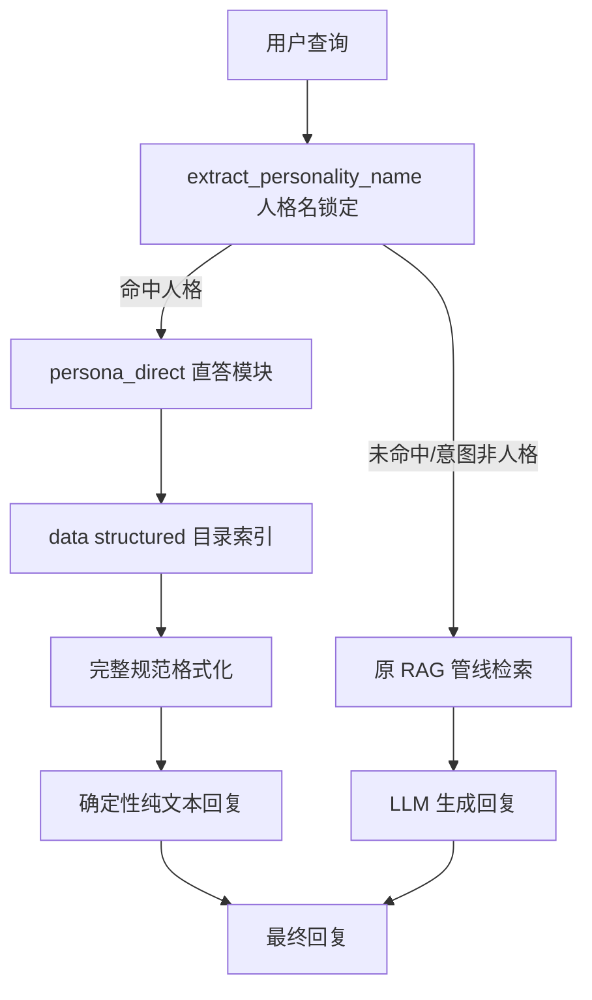

# 人格数据结构化直答方案（Persona Direct Answer）

## 一、问题背景

当前人格技能数据经过向量化后，`build_personality_chunks` 将每个技能 × 每个阶段拆成一个 chunk，
一个人格可产生几十个 chunk。检索时 top_k 有限（6），且受噪声过滤/阈值/渐进式轮次影响，
常出现**错漏**：目标人格技能数据被截断或混入其他人格内容。

关键事实：爬虫产出的结构化数据**本身就是完整 JSON**（`_personality_to_dict`），
只是被拆散成 chunk 才导致丢失。因此**绕开向量检索、直接从结构化 JSON 精确取数**是根治方案。

## 二、设计决策（已与用户确认）

| 维度 | 决策 |
|------|------|
| 输出内容 | 完整规范：技能（含四阶段/最高阶）+ 抗性 + 被动 + 罪孽亲和/资源等全部数据 |
| 数据源 | 爬取时生成独立 JSON 文件 `data/structured/persona_*.json`，重爬后自动重建；运行时直读该目录 |
| 输出形式 | 纯文本规范格式（可读排版），不经过 LLM，确定性输出 |

## 二点五、特殊人格数据结构分析（基于用户提供的 3 个示例）

用户提供 example/君主宝.txt（鸿璐鸿园的君主 10613）、example/小指良.txt（良秀蜘蛛巢小指父辈 10415）、
example/总督唐.txt（堂吉诃德拉·曼却领总督 10310）、example/绝望罗.txt（罗佳脑叶公司E.G.O:泪锋之剑 10913）
四个特殊人格示例，揭示关键结构：

| 特征 | 君主宝 | 小指良 | 总督唐 |
|------|--------|--------|--------|
| 技能模板 | `{{鸿璐式技能链接\|` | `{{技能链接\|` | `{{桑丘派技能链接` |
| 强化形态 | 无独立强化键 | 强化1技能（天杀）、强化2技能（必然杀） | 强化1~4技能（桑丘变体硬血N式） |
| 子变体 | 3技能2（开辟君主之道吧）、3技能3（孑然一身，舍生取园）、4技能2（护卫） | 嵌套 `{{技能4` 内 5技能（空间斩-缘） | 无 |
| 跳号 | 无 | 5技能（空间斩-残，攻击容量3） | 无 |
| 守备声明 | 4技能2 用 `\|类型2=守备` | 4技能 用 `\|类型=守备` | 4技能 用 `\|类型=攻击` |
| 被动 | 3 个 `{{人格被动链接\|ID}}` | 5 个 `{{人格被动链接\|ID}}` | 5 个 `{{人格被动链接\|ID}}` |
| 强化技能字段 | - | 含类型/罪孽 | 强化1/2/3 省略类型罪孽，强化4 含 |
| 正负硬币 | 无 | 无 | 无 |

新增示例：**绝望罗.txt**（罗佳脑叶公司E.G.O:泪锋之剑 10913）：
- **负硬币威力（减算技能）**：强化1/2/3/4技能的 `N阶硬币威力=-4/-5/-6`
  （基础技能均为正值 = 加算技能），人格相关信息注释"使用减算基础技能"
- **爬取逻辑已验证满足**：`_extract_stage_from_pane` 的 `变动值[：:]\s*([+-]?\d+)`
  与 `硬币威力[：:]\s*([+-]?\d+)` 均已含 `[+-]?`，可正确解析负硬币威力
- **新字段变体**：强化技能类型写作 `|强化4技能类型=攻击`（无 `-` 连接），
  与基础技能 `|4技能-类型=突刺`（带 `-`）不同 → 重爬阶段正则需同时覆盖两种写法

关键结论：

1. **技能名是真实的**：wikitext 中确有"我愿开辟前路 / 忍耐已经结束"等真实技能名；
   占位符人格显示占位符的根因是**解析器正则缺陷**，而非数据缺失
2. **现有 `_parse_skill_names_from_wikitext` 正则 `(\d+)\s*技能-名称` 无法匹配**：
   `强化N技能-名称`（总督唐/小指良）、`N技能M-名称`（君主宝 3技能2/4技能2）、`5技能-名称`（小指良）
   → 重爬阶段必须扩展正则，覆盖 强化N技能 / N技能M / 跳号
3. **被动为多链接引用**：`{{人格被动链接\|ID}}` 出现 3~5 次；
   现有 `_extract_passives`（依赖渲染 HTML 的 h3"被动"后 div 文本以"战斗/支援"开头）**完全失效**
   → 重爬阶段改为直接从 wikitext 提取全部 `{{人格被动链接\|...}}` 引用
4. **强化形态/子变体需要结构化表达**：现有 `skill.skill_index` 顺序递增（0,1,2...）无法表达
   "3技能2 是 3技能的衍生" / "强化1技能 是 1技能的强化形态"
   → 直答 JSON 需为每个技能补充 `wikitext_key`（原始键名，如 `强化1技能` / `3技能2`），
     格式化时据此标注强化/衍生关系

## 三、架构



### 数据流

1. **爬取阶段**：`spider.py` 抓取人格页面 → `extract_from_html` 产出结构化 dict →
   除写 `wiki_pages.jsonl` 外，**额外**写 `data/structured/persona_<title>.json`（按 title 去重覆盖）
2. **运行时**：`persona_direct` 模块启动时扫描 `data/structured/` 目录建立 `title → 数据` 索引
3. **查询**：`extract_personality_name` 锁定具体人格名 → 精确取 JSON → 规范格式化 → 直接返回

## 四、实现步骤

### Step 1：数据层 —— 结构化导出（crawler）

新建 `crawler/structured_exporter.py`：

- `ensure_structured_dir()`：确保 `data/structured/` 存在
- `export_persona_record(record: dict)`：将单个人格结构化 dict 写为
  `data/structured/persona_<安全文件名>.json`（title 中的 `/`、`::`、空格等转义为 `_` 或编码）
- `rebuild_all(input_jsonl, out_dir)`：从 `data/raw/wiki_pages.jsonl` 重建全部人格 JSON（供重爬后执行）
- `build_filename(title)`：title → 稳定唯一文件名（避免特殊字符问题）
- `load_persona_index(out_dir)`：扫描目录 → `{title: record}` 索引（供运行时复用）

**特殊人格 schema 要求**：导出时需为每个技能补充 `wikitext_key`（原始模板键名，如
`1技能` / `强化1技能` / `3技能2` / `4技能2` / `5技能`），并从 `skills[].skill_name`
映射真实技能名（见重爬阶段的正则修复）。若当前 `wiki_pages.jsonl` 中 `skill_name`
已是占位符，则先保留原始数据导出，待重爬后自动更新。

接入点（`crawler/spider.py`）：

- 在 `save_results_incremental` 写 `wiki_pages.jsonl` 处，对 `page_type == "personality"` 的记录
  同步调用 `export_persona_record`
- `crawl_wiki` 完成后（全量重爬路径）调用 `rebuild_all` 兜底，保证全量一致性

### Step 2：运行时模块 —— persona_direct

新建 `rag/persona_direct.py`：

- `PersonaDirectStore` 类：
  - `__init__(data_dir="data/structured")`：启动时懒加载扫描目录建立索引
  - `has_persona(title)` / `get_persona(title)` / `search(name_like)`：精确 + 前缀模糊
  - 昵称/别名解析复用 `rag/query_processor.py` 的 `NICKNAME_MAP` 与
    `extract_personality_name`（查询侧已能锁定到精确人格名）
- `format_persona_full(record) -> str`：按完整规范格式化输出（基于
  `diag_output_persona_skills_final.py` 的既有逻辑扩展）：
  - 基本信息：人格名 / 罪人 / 罪孽亲和 / 物理抗性 / E.G.O资源 / 实装日期 / 获取方式
  - 技能：每技能 → 技能名 / [罪孽][伤害] / 攻击容量 / 硬币数 / 各阶段（基础值+变动值+效果）/
    硬币效果（去重、跳过纯数值占位）
  - **特殊技能标注**：根据 `wikitext_key` 前缀识别并标注——
    - `强化N技能` → 标注"强化技能（N技能）"，与基础技能建立关联
    - `N技能M`（子变体）→ 标注"（N技能衍生）"
    - 跳号（如 `5技能`）→ 按实际键名标注
    - `类型2=守备` / `类型=守备` → 判定为守备技能
  - 被动：战斗被动 / 支援被动（若重爬后为多被动引用，则逐条列出并标注类型）
  - 语音：语音台词 / 技能语音（含文件引用）
  - 缺失字段留空（对齐既有规范）
- `try_direct_answer(query) -> Optional[str]`：
  1. 调用 `classify_intent` / `extract_personality_name` 判断是否命中人格名
  2. 命中 → `store.get_persona(title)` → `format_persona_full` → 返回文本
  3. 未命中 → 返回 `None`（回落 RAG）

### Step 3：接入 agent 主流程

`agent/core.py` `_generate_reply`：

- 初始化时若 `config.agent.persona_direct.enabled` → 构建 `PersonaDirectStore`
- `_generate_reply` 中，在调用 `run_rag_query` **之前**：
  - `direct = self.persona_direct.try_direct_answer(msg.text)`
  - 若 `direct` 非空 → 直接返回（跳过 LLM、跳过置信度/反思闭环）
  - 否则继续走原 RAG 链路

### Step 4：配置开关

`config.yaml`：

```yaml
agent:
  persona_direct:
    enabled: true
    data_dir: "data/structured"
```

### Step 5：验证

新建 `diag_persona_direct_verify.py`：

1. 4 个测试查询（浮士德黑兽-卯魁首 / 浮士德W公司2级清扫人员 / 七浮 / 李箱 lcb罪人）
   → 直答命中，输出完整规范文本
2. 非人格查询（如"8-33-06 剧情是什么"、"流血效果"）→ 直答返回 None，回落 RAG 生效
3. 缺失人格（如不存在的名字）→ 回落 RAG
4. LCB 别名 / 大小写变体 → 命中对应人格
5. 输出直答结果到文件供确认

## 五、边界与注意事项

1. **数据质量依赖重爬**：8 个占位符人格 + passive 全空问题，直答只是"展示已有数据"；
   数据本身仍待重爬阶段修复（见边界 6）
2. **直答与向量库并行**：人格数据查询走直答，其他类型（剧情/E.G.O/饰品/敌方/状态）仍走 RAG，
   互不冲突
3. **直答确定性**：绕过 LLM 意味着回答格式固定、无幻觉，但语气不人格化——符合用户"纯文本规范格式"要求
4. **文件命名安全**：`::`、`/`、空格等特殊字符需转义为安全文件名，索引时用 title 精确匹配
5. **增量爬取**：`save_results_incremental` 需同步导出新增/更新人格 JSON，保证目录与 jsonl 一致
6. **重爬阶段修复清单（依赖 item 22）**：
   - 扩展 `_parse_skill_names_from_wikitext` 正则，覆盖 `强化N技能-名称` / `N技能M-名称` /
     `5技能-名称` 等变体（修复 8 个占位符人格的真实技能名）
   - **字段写法变体**：技能类型既可能写作 `|N技能-类型=...`（带 `-`），也可能写作
     `|强化N技能类型=...`（无 `-`，见绝望罗），正则需同时覆盖两种写法
   - 重写 `_extract_passives`：从 wikitext 提取全部 `{{人格被动链接\|ID}}` 引用，
     并尝试解析对应被动名称/类型（解决 passive 全空）
   - 技能模板匹配：`{{鸿璐式技能链接` / `{{桑丘派技能链接` / `{{技能4`（嵌套）/ `{{技能链接`
     均需纳入解析（`_parse_skill_names_from_wikitext` 当前仅匹配 `{{技能链接`）
   - 为每个技能补充 `wikitext_key`（强化/衍生/跳号标识），写入结构化 dict
   - **负硬币威力**：`coin_power` 为负值时格式化须保留负号（如 `变动值：-4`），
     并可标注"减算技能"以区分加算/减算
7. **schema 版本兼容**：`data/structured/persona_*.json` 为派生产物，重爬后整体重建即可；
   不纳入 git，运行时若目录为空则直答自动失效并回落 RAG

## 六、交付物清单

| 文件 | 类型 | 说明 |
|------|------|------|
| `crawler/structured_exporter.py` | 新增 | 结构化 JSON 导出 |
| `crawler/spider.py` | 修改 | 接入导出调用 |
| `rag/persona_direct.py` | 新增 | 直答存储 + 完整格式化 + 入口 |
| `agent/core.py` | 修改 | 直答优先接入 |
| `config.yaml` | 修改 | persona_direct 开关 |
| `diag_persona_direct_verify.py` | 新增 | 直答验证脚本 |
