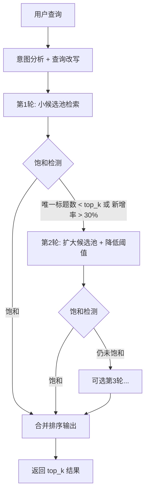

# 方案 B：信号驱动渐进式多轮检索

## 概述

用信号驱动的渐进式检索替代当前硬编码的 `vec_k_mult=30`、`final_k=100` 等特判。核心思路：先用小窗口检索，然后检测结果是否"饱和"；若不饱和则自动扩大候选池进行第二轮检索。

## 现状分析

当前 [`retrieve()`](rag/retriever.py:77) 中对 personality 查询有三处硬编码：

| 位置 | 硬编码 | 含义 |
|------|--------|------|
| [L108-114](rag/retriever.py:108) | `vec_k_mult=30, bm25_k_mult=50` | personality 候选池放大 6 倍 |
| [L219-223](rag/retriever.py:219) | `threshold - 0.15` | personality/plot 降低相似度门槛 |
| [L277-281](rag/retriever.py:277) | `final_k = max(top_k, 100)` | personality 返回最多 100 条 |

这些硬编码的根因是同一件事：personality 查询的语义相似度天然偏低（"人格"关键词在 chunk 中密度低），单轮小候选池无法捕获足够多的相关文档。

## 渐进式检索流程



## 重构细节

### 1. 新增 `_retrieval_pipeline()` 私有方法

将当前 `retrieve()` 中 L107-253 的核心检索逻辑（向量搜索 → BM25 融合 → title boost → 相似度转换 → keyword boost → category penalty → 排序）提取为独立方法：

```python
def _retrieval_pipeline(
    self,
    rewritten_query: str,
    effective_filter: Optional[dict],
    vec_k: int,
    bm25_k: int,
    active_threshold: float,
    persona_name: Optional[str],
) -> list[tuple[str, float, Any]]:
    """
    单轮检索管道，返回 (dedup_key, combined_score, doc) 列表。

    不做标题去重——由外层循环统一去重。
    """
```

**输出格式**：`(dedup_key, combined_score, doc)`，其中 `dedup_key` 使用 `_make_doc_key()` 与 `bm25_index.py` 保持一致。

### 2. 重构 `retrieve()` 为渐进式循环

```python
def retrieve(self, query, filter_dict=None, persona_name=None):
    # ── Phase 1: 意图分析 + 查询改写（保持不变）──
    name = persona_name or self.persona_name
    rewritten_query, intent_filter = get_filter_and_query(query, name)
    effective_filter = ...

    # ── Phase 2: 渐进式多轮检索 ──
    all_keyed: dict[str, tuple[float, Any]] = {}  # key → (score, doc)

    for round_idx in range(self.max_retrieval_rounds):
        vec_k = self.top_k * self.round_k_multipliers[round_idx]
        bm25_k = self.top_k * self.round_bm25_multipliers[round_idx]
        # 每轮阈值递减 0.10（首轮用原始阈值，次轮放宽）
        rthreshold = max(0.15, self.similarity_threshold - round_idx * 0.10)

        round_docs = self._retrieval_pipeline(
            rewritten_query, effective_filter,
            vec_k=vec_k, bm25_k=bm25_k,
            active_threshold=rthreshold,
            persona_name=name,
        )

        # 合并去重
        new_in_round = 0
        for key, score, doc in round_docs:
            if key not in all_keyed or score > all_keyed[key][0]:
                if key not in all_keyed:
                    new_in_round += 1
                all_keyed[key] = (score, doc)

        # ── 饱和检测 ──
        # 条件1: 已有足够唯一标题 (≥ top_k)
        # 条件2: 本轮新增率低 (< top_k * 30%)，继续扩池收益递减
        if len(all_keyed) >= self.top_k and new_in_round < self.top_k * self.saturation_threshold:
            break

    # ── Phase 3: 输出 ──
    sorted_docs = sorted(all_keyed.values(), key=lambda x: x[0], reverse=True)

    # 动态 final_k：当唯一标题远多于 top_k 时自动放量
    # 例：personality 查询去重后有 15 个唯一标题 → 返回 min(6*3, 15)=15
    # 例：character 查询去重后有 3 个唯一标题 → 返回 max(6, 3)=6
    unique_count = len(sorted_docs)
    final_k = max(self.top_k, min(unique_count, self.top_k * self.result_mult_cap))

    return [doc for _, doc in sorted_docs[:final_k]]
```

### 3. 移除的硬编码

| 移除项 | 原位置 | 替代方案 |
|--------|--------|----------|
| `vec_k_mult = 30` for personality | L112-113 | 渐进式 round 2 自动放大 |
| `bm25_k_mult = 50` for personality | L114 | 同上 |
| `active_threshold - 0.15` for personality/plot | L219-223 | 渐进式逐轮递减阈值 (round_idx * 0.10) |
| `final_k = max(top_k, 100)` for personality | L279-281 | `result_mult_cap` 比率制 (默认 4x) |

### 4. 新增配置参数

在 `config.yaml` 的 `retrieval` 段新增：

```yaml
retrieval:
  # ... 现有配置保持不变 ...
  
  # ── 渐进式检索 ──
  progressive:
    enabled: true                     # 是否启用多轮渐进检索
    max_rounds: 2                     # 最大检索轮数
    round_k_multipliers: [5, 20]      # 每轮向量 k 乘数（top_k × multiplier）
    round_bm25_multipliers: [10, 40]  # 每轮 BM25 k 乘数
    saturation_threshold: 0.3         # 饱和检测阈值（新增率 < top_k × 此值则停止）
    result_mult_cap: 4                # 最终输出上限（top_k × cap，自适应动态放量）
```

### 5. `LimBusRetriever.__init__` 新增参数

```python
def __init__(self, ..., 
             max_retrieval_rounds: int = 2,
             round_k_multipliers: tuple = (5, 20),
             round_bm25_multipliers: tuple = (10, 40),
             saturation_threshold: float = 0.3,
             result_mult_cap: int = 4):
```

## 动态 BM25 权重保留

当前的动态 BM25 权重降级逻辑（[L161-173](rag/retriever.py:161)）**保留不变**。它解决的是 BM25 post-filter 后候选过少导致的 minmax 归一化失真问题，与渐进式检索正交——即使多轮检索中 BM25 候选也会遇到同样的问题。

## 影响范围

| 文件 | 变更类型 |
|------|----------|
| `rag/retriever.py` | 重构：新增 `_retrieval_pipeline()`，重写 `retrieve()` 为渐进循环 |
| `config.yaml` | 新增 `retrieval.progressive` 配置段 |
| `agent/core.py` | 无需修改（`initialize_rag` 传递新参数即可） |

## 行为变化对比

| 场景 | 当前行为 | 新行为 |
|------|----------|--------|
| "你是谁" (character) | vec_k=30, BM25归并, top 6 | Round 1: vec_k=30 → 饱和 → 输出 6 |
| "浮士德 人格" (personality) | vec_k=180, BM25=300, final_k=100 | Round 1: vec_k=30 → 不饱和 → Round 2: vec_k=120, 阈值-0.1 → 饱和 → 输出 ~15 |
| "擅长什么" (character) | vec_k=30, BM25动权0.15 | Round 1: vec_k=30 + 动权 → 不饱和 → Round 2: vec_k=120 → 饱和 → 输出 6 |
| 通用 Lore 查询 | vec_k=30, 无filter | Round 1: vec_k=30 → 饱和 → 输出 6 |

## 潜在风险

1. **Round 2 延迟**：额外一次向量搜索 + BM25 搜索（~50-100ms），仅在首轮不饱和时触发
2. **阈值递减可能引入噪音**：`threshold - 0.10` 在第二轮可能让低质量 chunk 混入。缓解：合并排序后低分文档自然排在末尾，top_k 截断会过滤掉
3. **饱和阈值 0.3 需实测调优**：30% 新增率是基于经验的初始值，需通过 diag_boost.py 测试验证

## 后续扩展（方案 C）

如果渐进检索后仍有"回答不完整"的反馈，可在 `agent/core.py` 的 `_generate_reply()` 中叠加 LLM 追问层：
- 检测回答中是否包含"对此没有足够的信息"
- 若触发，让 LLM 生成追问词 → 再次调用 `retriever.retrieve()` → 补充回答
- 最多 1 次追问，避免无限循环
