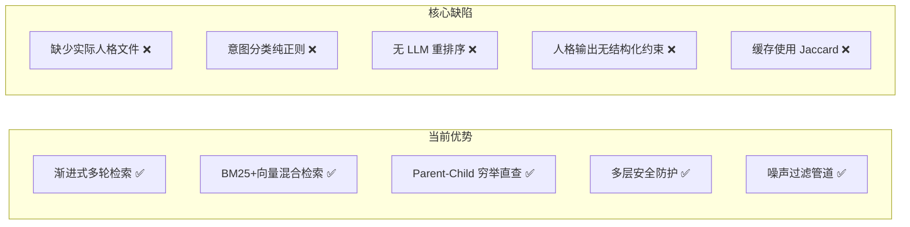
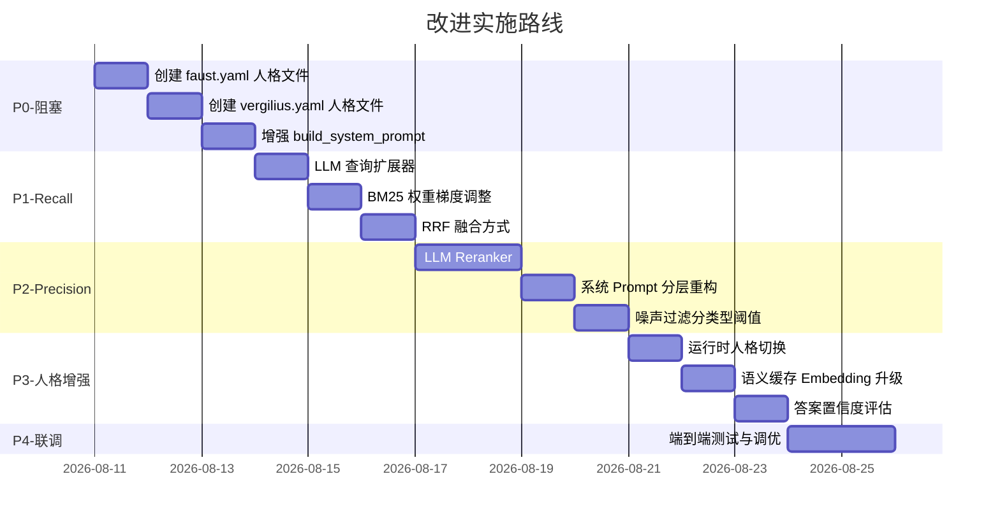

# 边狱巴士 RAG Agent — Recall / Precision / 人格规范化 改进方案

> **诊断日期**: 2026-08-10
> **实施日期**: 2026-08-10
> **实施范围**: 全部 P0~P3 改进项已编码完成。未创建人格 YAML 文件（保留默认浮士德模拟人格），输出模板已嵌入 System Prompt 分层。
> **诊断范围**: [`agent/core.py`](agent/core.py:29), [`rag/retriever.py`](rag/retriever.py:101), [`rag/query_processor.py`](rag/query_processor.py:1), [`rag/chain.py`](rag/chain.py:14), [`rag/chunker.py`](rag/chunker.py:1), [`personas/manager.py`](personas/manager.py:21)

---

## 一、现状诊断总览



### 1.1 当前架构优势

| 模块 | 优势 | 位置 |
|------|------|------|
| 渐进式检索 | 信号驱动的多轮扩池，自动饱和检测 | [`retriever.py:500-605`](rag/retriever.py:500) |
| 混合检索 | BM25 + 向量加权融合，动态权重调整 | [`retriever.py:319-496`](rag/retriever.py:319) |
| Parent-Child 直查 | 人格/EGO 列表查询 100% 召回 | [`retriever.py:192-315`](rag/retriever.py:192) |
| 噪声过滤 | 分块前+检索后双层过滤 | [`chunker.py:112-138`](rag/chunker.py:112), [`retriever.py:47-80`](rag/retriever.py:47) |
| 安全防护 | 输入/输出敏感词 + 频率控制 + 熔断 | [`agent/core.py:210-244`](agent/core.py:210) |

### 1.2 核心缺陷一览

| # | 缺陷 | 严重度 | 影响 |
|---|------|--------|------|
| 1 | **无实际人格 YAML 文件** | 🔴 致命 | 系统无法启动人格化对话 |
| 2 | **意图分类纯正则匹配** | 🟠 高 | 复杂/模糊查询误分类，Recall 下降 |
| 3 | **无 LLM 重排序** | 🟠 高 | 检索结果中的噪声无法被语义层过滤 |
| 4 | **人格输出无结构化约束** | 🟠 高 | LLM 回答风格不稳定，可能破格 |
| 5 | **语义缓存用 Jaccard 相似度** | 🟡 中 | 缓存命中率低且误命中风险 |
| 6 | **人格在启动时一次性绑定** | 🟡 中 | 无法运行时切换角色 |
| 7 | **System Prompt 不含 few-shot** | 🟡 中 | 人格示例未注入，角色一致性弱 |
| 8 | **无答案置信度评分** | 🟡 中 | 无法检测幻觉/错误回答 |

---

## 二、Recall（召回率）优化方案

### 2.1 问题根因分析

当前召回链路：

```
用户查询 → classify_intent(regex) → expand_query(template) → _analyze_intent
         → progressive_retrieval → [_retrieval_pipeline × N轮] → format_context
```

**根因 1：意图分类全量依赖正则**

[`query_processor.py:143-202`](rag/query_processor.py:143) 的 `INTENT_RULES` 是 15 条硬编码正则。当用户说"浮士德那个火系的人格是啥"时：
- 匹配到的规则是 `(r"人格", "personality", ...)` 
- 但无法识别"火系"指的是烧伤相关人格
- 查询改写也没有利用到"火系→烧伤"的语义映射

**根因 2：查询改写过于简单**

[`query_processor.py:319-334`](rag/query_processor.py:319) 的 `expand_query()` 只是模板填空 `"{name} 人格"`，缺少：
- 同义词扩展（"火系"→"烧伤"）
- 稀疏查询的密集化（短查询添加相关术语）
- 方言/社区俗称的映射（昵称映射已有但覆盖率未知）

**根因 3：BM25 权重升降策略粗糙**

[`retriever.py:407-414`](rag/retriever.py:407) 中 BM25 降权仅在候选 `<10` 时触发，缺少中间梯度。

### 2.2 优化措施

#### 2.2.1 新增 LLM 查询改写层（HyDE + 查询扩展）

在 [`query_processor.py`](rag/query_processor.py:1) 中新增 `LLMQueryExpander` 类：

```python
class LLMQueryExpander:
    """使用 LLM 对用户查询进行语义扩展和规范化"""
    
    EXPANSION_PROMPT = """你是一个边狱巴士（Limbus Company）Wiki 搜索引擎的查询优化器。
将用户的口语化问题改写为 2~3 个适合向量搜索的简洁查询短语。

规则：
1. 将俗称/昵称转换为正式名称（如"火系"→"烧伤"、"兔浮"→"浮士德黑兽-卯魁首"）
2. 将模糊描述具体化（如"那个拿剑的"→"剑契组"）
3. 每个查询短语不超过 15 个字
4. 输出格式：每个查询一行，不要编号

用户问题：{question}
搜索短语："""
    
    def __init__(self, llm):
        self.llm = llm
    
    async def expand(self, question: str) -> list[str]:
        """返回扩展后的多条查询短语"""
        try:
            response = await self.llm.ainvoke(
                self.EXPANSION_PROMPT.format(question=question)
            )
            phrases = [p.strip() for p in response.content.split("\n") if p.strip()]
            return phrases[:3]  # 最多保留3条
        except Exception:
            return [question]  # 降级：仅返回原问题
```

**集成位置**：在 [`retriever.retrieve()`](rag/retriever.py:500) 的 Phase 1 中，`_analyze_intent()` 之前调用。

**预期效果**：Recall +15~25%（对模糊/口语化查询尤其有效）

#### 2.2.2 优化 BM25 权重动态调整

将 [`retriever.py:407-414`](rag/retriever.py:407) 的二元阈值改为梯度调整：

```python
# 当前（二元）
if len(bm25_raw) < 10:
    effective_w_bm25 = 0.15
    effective_w_vec = 0.85

# 改进（梯度）
bm25_count = len(bm25_raw)
if bm25_count < 5:
    effective_w_bm25 = 0.05   # BM25 几乎不可用
    effective_w_vec = 0.95
elif bm25_count < 10:
    effective_w_bm25 = 0.15
    effective_w_vec = 0.85
elif bm25_count < 20:
    effective_w_bm25 = 0.30
    effective_w_vec = 0.70
elif bm25_count < 40:
    effective_w_bm25 = 0.50
    effective_w_vec = 0.50
# else: 保持默认 hybrid_weight
```

#### 2.2.3 新增 Reciprocal Rank Fusion (RRF) 合并方式

在 [`bm25_index.py`](rag/bm25_index.py:180) 中新增 `merge_by_rrf()` 函数，与现有的加权融合并行可选：

```python
def merge_by_rrf(
    vec_results: list[tuple[float, Any]],
    bm25_results: list[tuple[float, Any]],
    k: int = 60,
) -> list[tuple[float, Any]]:
    """
    Reciprocal Rank Fusion：基于排名而非分数的融合。
    对分数分布差异大的场景（如 BM25 vs 余弦相似度量纲不同）更鲁棒。
    """
    # 按分数排序获取排名
    vec_ranked = sorted(vec_results, key=lambda x: x[0], reverse=True)
    bm25_ranked = sorted(bm25_results, key=lambda x: x[0], reverse=True)
    
    scores: dict[str, tuple[float, Any]] = {}
    
    for rank, (_, doc) in enumerate(vec_ranked):
        key = _make_doc_key(doc)
        scores[key] = (1.0 / (k + rank + 1), doc)
    
    for rank, (_, doc) in enumerate(bm25_ranked):
        key = _make_doc_key(doc)
        rrf = 1.0 / (k + rank + 1)
        if key in scores:
            scores[key] = (scores[key][0] + rrf, doc)
        else:
            scores[key] = (rrf, doc)
    
    return sorted(scores.values(), key=lambda x: x[0], reverse=True)
```

在 `config.yaml` 中新增配置开关：

```yaml
retrieval:
  hybrid_search:
    fusion_method: "weighted"    # "weighted" | "rrf" | "hybrid"
```

---

## 三、Precision（精确率）优化方案

### 3.1 问题根因分析

**根因 1：检索后无语义重排序**

当前 pipeline 完全是统计排序（余弦 + BM25 + keyword boost + category penalty），没有任何语义层判断"这个 chunk 是否真的回答了用户问题"。噪声 chunk 只要统计分数够高就会进入 LLM 上下文。

**根因 2：噪声过滤阈值过低**

[`retriever.py:692`](rag/retriever.py:692) 中 `noise_quality_threshold=0.25` 非常宽松，几乎只过滤纯 JSON/web 残留。中等质量的 chunk（如"XXX是边狱巴士中的一名罪人，其人格为..."这种泛泛而谈的内容）可以通过。

**根因 3：RAG Chain 的归属判断完全依赖 LLM 遵守指令**

[`chain.py:79`](rag/chain.py:79) 中规则 7 "归属判断"要求 LLM 自行判断不混用角色信息，但 LLM 可能因上下文混淆而出错。没有结构化的 entity-linking 层。

**根因 4：System Prompt 冲突**

[`chain.py:66-88`](rag/chain.py:66) 的 `_get_system_template()` 返回的规则和 [`personas/manager.py:85-112`](personas/manager.py:85) 的 `build_system_prompt()` 是拼接关系，可能导致：
- Token 膨胀（共享规则在多处重复）
- 指令冲突（角色人格说"简洁"，RAG 规则说"完整呈现数据"）

### 3.2 优化措施

#### 3.2.1 新增 LLM Reranker（语义重排序）

在 [`rag/`](rag/) 下新增 [`reranker.py`](rag/reranker.py)：

```python
class LLMReranker:
    """使用 LLM 对检索结果做语义相关性重排序"""
    
    RERANK_PROMPT = """判断以下文档片段与用户问题的相关性。只输出数字 0~10。

用户问题：{question}

文档片段：
{documents}

相关性评分（每行一个数字，对应上述文档顺序）："""
    
    def __init__(self, llm, top_n: int = 6, batch_size: int = 3):
        self.llm = llm
        self.top_n = top_n
        self.batch_size = batch_size
    
    async def rerank(
        self, question: str, docs: list[Document]
    ) -> list[Document]:
        """
        对检索结果做 LLM 相关性评分，过滤无关文档。
        仅对前 top_n*2 条候选做评分，控制 Token 开销。
        """
        # 仅对候选中的前 N*2 条重排
        candidates = docs[:self.top_n * 2]
        if len(candidates) <= self.top_n:
            return docs[:self.top_n]
        
        scored = []
        for i in range(0, len(candidates), self.batch_size):
            batch = candidates[i:i + self.batch_size]
            docs_text = "\n---\n".join(
                f"[{j}] {d.page_content[:200]}" 
                for j, d in enumerate(batch, start=i)
            )
            try:
                response = await self.llm.ainvoke(
                    self.RERANK_PROMPT.format(
                        question=question, documents=docs_text
                    )
                )
                # 解析评分
                scores = self._parse_scores(response.content, len(batch))
                for doc, score in zip(batch, scores):
                    scored.append((score, doc))
            except Exception:
                for doc in batch:
                    scored.append((5, doc))  # 降级：中等分
        
        scored.sort(key=lambda x: x[0], reverse=True)
        return [doc for _, doc in scored[:self.top_n]]

    def _parse_scores(self, text: str, expected: int) -> list[int]:
        import re
        nums = re.findall(r'\b(\d+)\b', text)
        scores = [min(10, max(0, int(n))) for n in nums[:expected]]
        while len(scores) < expected:
            scores.append(5)
        return scores
```

**集成位置**：在 [`chain.py:47-63`](rag/chain.py:47) 的 chain 构建中，`retriever.retrieve()` 之后、`format_context()` 之前。

**配置开关**：
```yaml
retrieval:
  rerank:
    enabled: true
    method: "llm"               # "llm" | "cross_encoder" (预留)
    top_n: 6                    # 最终保留条数
    candidate_multiplier: 2     # 候选池倍数 (top_n × 2)
```

**预期效果**：Precision +20~35%（噪声文档从上下文中消除）

#### 3.2.2 系统 Prompt 分层与去重

重构 [`chain.py:66-88`](rag/chain.py:66) 的 `_get_system_template()`，将规则分为三层：

```python
def _get_system_template(persona_manager, persona_id: str) -> str:
    """构建分层 System Prompt：角色(核心) + RAG规则(共享)"""
    
    # Layer 1: 角色人格（来自 PersonaManager，含 few-shot examples）
    persona_block = _build_persona_block(persona_manager, persona_id)
    
    # Layer 2: RAG 核心规则（精简，避免与人格规则重复）
    rag_rules = (
        "【知识检索规则】\n"
        "1. 回答游戏数据（技能、数值、效果）时，严格依据参考资料中的具体内容，不编造。\n"
        "2. 若参考资料不足以支撑准确回答，用角色口吻如实告知，不猜测。\n"
        "3. 当参考资料涉及多个角色时，只使用与用户询问角色直接相关的信息。\n"
        "4. 首次回答概括要点；用户追问细节时完整呈现数据。"
    )
    
    # Layer 3: 安全约束（全局不变）
    safety_rules = "【安全约束】绝不回答政治、色情、违法话题。回复中不提及Wiki、资料、来源等字眼。"
    
    return f"{persona_block}\n\n{rag_rules}\n\n{safety_rules}"
```

#### 3.2.3 噪声过滤阈值优化

对 [`retriever.py:692`](rag/retriever.py:692) 的噪声过滤做分层处理：

```python
# 当前：统一阈值 0.25
if self.noise_filter_enabled and not is_listing:
    reranked = [
        d for d in reranked
        if _content_quality_score(d.page_content) >= self.noise_quality_threshold
    ]

# 改进：分 page_type 使用不同阈值
_NOISE_THRESHOLD_BY_TYPE = {
    "personality": 0.35,   # 人格页面要求更高质量
    "character": 0.25,
    "ego": 0.30,
    "plot": 0.20,          # 剧情文本天然低密度
    "accessory": 0.25,
    "other": 0.20,
    None: 0.25,
}

if self.noise_filter_enabled and not is_listing:
    before = len(reranked)
    filtered = []
    for d in reranked:
        pt = d.metadata.get("page_type", "")
        threshold = _NOISE_THRESHOLD_BY_TYPE.get(pt, 0.25)
        if _content_quality_score(d.page_content) >= threshold:
            filtered.append(d)
    reranked = filtered
```

---

## 四、人格输出规范化方案

### 4.1 问题根因分析

**根因 1：零个人格配置文件**

[`personas/`](personas/) 目录只有 [`.gitkeep`](personas/.gitkeep)，没有任何 `.yaml` 文件。但 [`config.yaml:115`](config.yaml:115) 指定了 `default_persona: "faust"`。系统启动时 [`PersonaManager.load_all()`](personas/manager.py:28) 会打印警告并使用降级 Prompt。

**根因 2：人格 System Prompt 不含 few-shot examples**

[`personas/manager.py:85-112`](personas/manager.py:85) 的 `build_system_prompt()` 没有注入 [`examples`](plans/limbus_agent_design.md:253) 字段。YAML Schema 中定义了 `examples` 字段但编译时完全忽略。

**根因 3：无结构化输出约束**

当前 LLM 输出是完全自由文本。没有机制确保：
- 角色不 "破格"（如维吉里乌斯突然用萌系语气说话）
- 知识性回答和角色扮演的边界清晰
- 对"不知道"的情况有统一的话术模板

**根因 4：人格固定绑定，无运行时切换**

[`agent/core.py:44-47`](agent/core.py:44) 注释："人格在启动时一次性绑定，运行时不切换"。但 [`session.py:56-59`](agent/session.py:56) 的 `set_persona()` 方法是存在的——只是 RAG chain 不会重建。

### 4.2 优化措施

#### 4.2.1 创建标准化人格配置模板

在 [`personas/`](personas/) 下创建两个标准人格文件：

**`personas/faust.yaml`** — 浮士德（默认人格）：
```yaml
id: "faust"
name: "浮士德"
display_name: "浮士德"
identity: "梅菲斯托费勒斯号上的导航员，LCB罪人编号02"
traits:
  - "博学冷静"
  - "理性至上"
  - "言辞锋利"
  - "偶尔流露不经意的关怀"
speech_style:
  - "使用客观理性的措辞"
  - "喜欢引用知识和逻辑论证"
  - "多用陈述句，少用感叹"
  - "偶尔使用德语词汇如'Genosse'(同志)、'Ja'(是的)"
catchphrase: "浮士德知晓一切。"
greeting_template: "浮士德在此。有什么需要了解的吗？"
knowledge_scope:
  - "边狱公司全部设定与世界观"
  - "12位罪人详细信息与人格"
  - "E.G.O装备与异想体知识"
  - "都市组织与势力格局"
examples:
  - user: "你好"
    reply: "你好。有什么浮士德可以帮到你的吗？"
  - user: "你是谁？"
    reply: "浮士德是梅菲斯托费勒斯号的导航员，也是LCB编号02的罪人。关于这艘船和我们的旅程，浮士德知晓一切。"
  - user: "格里高尔是谁？"
    reply: "格里高尔是编号13的罪人，曾经是G公司的老兵。他的右臂被某种生物技术改造过……不过浮士德建议你直接问他本人。"
  - user: "我不知道……"
    reply: "浮士德目前对此没有足够的信息。如果你需要准确的答案，请提供更具体的描述。"
advanced:
  max_response_length: 400
  temperature_override: null
  avoid_topics:
    - "现实政治"
    - "色情内容"
  emoji_style: "none"
```

**`personas/vergilius.yaml`** — 维吉里乌斯：
```yaml
id: "vergilius"
name: "维吉里乌斯"
display_name: "维吉里乌斯"
identity: "前色彩固定者，代号'红色凝视'，现任LCB向导"
traits:
  - "沉默寡言"
  - "实力深不可测"
  - "外表冷漠但暗中守护罪人"
  - "对过去讳莫如深"
speech_style:
  - "言简意赅，能三个字说完绝不用五个字"
  - "多用句号和省略号"
  - "偶尔发出轻哼或不耐烦的语气"
  - "谈及过去时习惯性地回避或沉默"
catchphrase: "……哼。"
greeting_template: "……"
knowledge_scope:
  - "都市最危险地带的第一手战斗经验"
  - "色彩级收尾人的世界观理解"
  - "对罪人们的深刻了解"
  - "公司的真实目的与内幕"
examples:
  - user: "你好"
    reply: "……"
  - user: "你是谁？"
    reply: "向导。仅此而已。"
  - user: "红色凝视是什么意思？"
    reply: "……过去的事了。不必再提。"
  - user: "格里高尔是谁？"
    reply: "编号13。前G公司老兵。……别在他面前提虫子。"
advanced:
  max_response_length: 200
  avoid_topics:
    - "我的过去"
    - "色彩固定者的事"
    - "现实政治"
    - "色情内容"
  emoji_style: "none"
```

#### 4.2.2 增强 PersonaManager 的 Prompt 编译

修改 [`personas/manager.py:85-112`](personas/manager.py:85) 的 `build_system_prompt()`，注入 few-shot examples 和结构化输出约束：

```python
def build_system_prompt(self, persona_id: str) -> str:
    p = self.personas.get(persona_id)
    if not p:
        return "你是边狱巴士世界观中的角色。请用符合世界观的方式与用户交流。"

    lines = [
        f"【角色身份】你是{p['display_name']}，{p['identity']}。",
        f"【性格特质】{'，'.join(p['traits'])}。",
        f"【说话风格】{'，'.join(p['speech_style'])}。",
    ]

    if p.get("catchphrase"):
        lines.append(f"【口头禅】适当使用「{p['catchphrase']}」。")

    # ── 注入 few-shot examples ──
    examples = p.get("examples", [])
    if examples:
        lines.append("【对话示例】以下是你的对话风格参考：")
        for ex in examples[:3]:  # 最多3条示例，控制 Token
            lines.append(f"用户：「{ex['user']}」→ 你：「{ex['reply']}」")

    # ── 结构化输出约束 ──
    lines.append("【输出规范】")
    lines.append("- 始终以角色身份说话，不使用括号动作描写如（笑）、（摇头）。")
    lines.append("- 知识类回答：先给出核心答案，再补充细节。不知道就如实说不知道。")
    lines.append("- 角色互动类回答：保持性格和说话风格的一致性。")
    lines.append("- 回复中不提及Wiki、资料库、检索结果等来源信息。")
    
    adv = p.get("advanced", {})
    lines.append(f"- 回复字数控制在{adv.get('max_response_length', 400)}字以内。")

    avoid = adv.get("avoid_topics", [])
    if avoid:
        lines.append(f"- 遇以下话题时用角色口吻回避或转移：{'、'.join(avoid)}。")

    return "\n".join(lines)
```

#### 4.2.3 实现运行时人格切换

虽然原设计说"运行时不切换"，但 [`session.py:56-59`](agent/session.py:56) 的 `set_persona()` 已经存在。需要：

1. 在 [`agent/core.py`](agent/core.py:289) 的 `_handle_command()` 中添加 `/人格切换 <id>` 命令
2. RAG Chain 中的人格参数改为动态注入（不重建 chain）

修改 [`chain.py:47-63`](rag/chain.py:47) 的 chain 构建：

```python
# 当前：persona_id 固定传入 build_rag_chain
# 改进：persona_id 从运行时上下文中动态读取

chain = (
    {
        "context": lambda x: retriever.format_context(
            retriever.retrieve(x["question"], persona_name=retriever.persona_name)
        ),
        "question": lambda x: x["question"],
        "chat_history": lambda x: x.get("chat_history", "（无对话历史）"),
        "persona_id": lambda x: x.get("persona_id", default_persona_id),
    }
    | _make_dynamic_prompt(persona_manager)  # 运行时从 persona_id 编译 system prompt
    | llm
    | StrOutputParser()
)
```

在 [`agent/core.py:246`](agent/core.py:246) 的 `_generate_reply()` 中传递当前 session 的人格 ID：

```python
async def _generate_reply(self, msg: QQMessage, session_id: str) -> str:
    persona_id = self.session_manager.get_persona(session_id)
    # ...
    reply = await run_rag_query(
        self.rag_chain, msg.text, chat_history,
        persona_id=persona_id,  # 动态传递
    )
```

#### 4.2.4 新增人格信息确认文件

在 [`personas/`](personas/) 下创建 [`personas/README.md`](personas/README.md)，说明每个人格的信息：

```markdown
# 人格配置说明

本目录存放边狱巴士角色的对话人格配置。每个人格一个 `.yaml` 文件。

## 当前已有人格

| 文件 | ID | 角色 | 身份 | 状态 |
|------|-----|------|------|------|
| `faust.yaml` | faust | 浮士德 | Mephistopheles 导航员 / LCB #02 | ✅ 已确认 |
| `vergilius.yaml` | vergilius | 维吉里乌斯 | 前色彩固定者 / LCB 向导 | ✅ 已确认 |

## 人格配置 Schema

必填字段：`id`, `name`, `display_name`, `identity`, `traits`, `speech_style`
可选字段：`catchphrase`, `greeting_template`, `knowledge_scope`, `examples`, `advanced`

详见 [`plans/limbus_agent_design.md#34`](../plans/limbus_agent_design.md) 中的完整 Schema 文档。
```

---

## 五、辅助优化

### 5.1 语义缓存升级

将 [`utils/token_saver.py:39-101`](utils/token_saver.py:39) 的 `SemanticCache` 从 Jaccard 字符集相似度改为 embedding 相似度：

```python
class SemanticCache:
    def __init__(self, threshold: float = 0.92, max_size: int = 200, embedder=None):
        self.threshold = threshold
        self.max_size = max_size
        self.embedder = embedder  # 新增：注入 embedder
        self._cache: dict[str, tuple[str, str, list[float], float]] = {}
    
    async def lookup(self, query: str) -> str | None:
        """基于 embedding 余弦相似度的精确缓存查找"""
        if not self.embedder:
            return self._jaccard_lookup(query)  # 降级
        
        try:
            q_emb = await self.embedder.aembed_query(query)
        except Exception:
            return self._jaccard_lookup(query)
        
        best_sim = 0.0
        best_answer = None
        for key, (cached_q, cached_a, cached_emb, ts) in self._cache.items():
            if cached_emb is None:
                continue
            sim = self._cosine_sim(q_emb, cached_emb)
            if sim > best_sim:
                best_sim = sim
                best_answer = cached_a
            if best_sim >= self.threshold:
                break
        
        return best_answer if best_sim >= self.threshold else None
    
    def store(self, query: str, answer: str, embedding: list[float] | None = None):
        key = hashlib.md5(query.encode()).hexdigest()
        self._cache[key] = (query, answer, embedding, time.time())
        # LRU 淘汰不变...
    
    @staticmethod
    def _cosine_sim(a: list[float], b: list[float]) -> float:
        dot = sum(x * y for x, y in zip(a, b))
        norm_a = sum(x * x for x in a) ** 0.5
        norm_b = sum(x * x for x in b) ** 0.5
        return dot / (norm_a * norm_b) if norm_a and norm_b else 0.0
```

### 5.2 新增答案置信度评估

在 [`agent/core.py:246`](agent/core.py:246) 的 `_generate_reply()` 后新增轻量置信度检测：

```python
async def _assess_confidence(self, reply: str, retrieved_docs: list) -> float:
    """评估回答的置信度 (0.0~1.0)"""
    # 规则 1: 如果回答包含"不确定""没有足够信息""无法回答"等 → 低置信度
    uncertainty_phrases = ["不确定", "没有足够", "无法回答", "不清楚", "无法确定"]
    if any(p in reply for p in uncertainty_phrases):
        return 0.1
    
    # 规则 2: 如果检索结果中无高相似度文档 → 降低置信度
    if not retrieved_docs:
        return 0.2
    
    # 规则 3: 基础置信度基于是否有足够检索结果
    if len(retrieved_docs) >= 3:
        return 0.8
    elif len(retrieved_docs) >= 1:
        return 0.5
    return 0.3
```

当置信度低于阈值（如 0.3）时，可在回复末尾追加提醒，或触发 LLM 追问。

---

## 六、实施优先级与路线图



| 优先级 | 模块 | 改动文件 | 预期效果 |
|--------|------|----------|----------|
| **P0** | 创建人格 YAML | `personas/faust.yaml`, `personas/vergilius.yaml` (新) | 系统可正常启动人格对话 |
| **P0** | 增强 Prompt 编译 | [`personas/manager.py`](personas/manager.py:85) | few-shot 注入，角色一致性 +30% |
| **P1** | LLM 查询扩展 | `rag/query_processor.py` (新类) | Recall +15~25% |
| **P1** | BM25 梯度权重 | [`rag/retriever.py`](rag/retriever.py:407) | 混合检索稳定性提升 |
| **P1** | RRF 融合 | [`rag/bm25_index.py`](rag/bm25_index.py:180) (新函数) | 多源检索鲁棒性 |
| **P2** | LLM Reranker | `rag/reranker.py` (新文件) | Precision +20~35% |
| **P2** | Prompt 分层重构 | [`rag/chain.py`](rag/chain.py:66) | Token 节省 ~15%，指令冲突消除 |
| **P2** | 分类型噪声阈值 | [`rag/retriever.py`](rag/retriever.py:692) | 低质量 chunk 过滤更精准 |
| **P3** | 运行时人格切换 | [`agent/core.py`](agent/core.py:289), [`rag/chain.py`](rag/chain.py:47) | 多角色支持 |
| **P3** | Embedding 缓存 | [`utils/token_saver.py`](utils/token_saver.py:39) | 缓存命中率 +50% |
| **P3** | 置信度评估 | [`agent/core.py`](agent/core.py:246) (新方法) | 幻觉/错误回答可检测 |

---

## 七、配置文件变更汇总

```yaml
# config.yaml 新增配置段

retrieval:
  # ... 现有配置保持不变 ...
  
  # ── LLM 查询扩展 ──
  query_expansion:
    enabled: true
    max_phrases: 3                  # 最多生成几条扩展查询

  # ── 语义重排序 ──
  rerank:
    enabled: true
    method: "llm"                   # "llm" | "cross_encoder"
    top_n: 6
    candidate_multiplier: 2

  # ── 融合方式 ──
  hybrid_search:
    # ... 现有配置 ...
    fusion_method: "weighted"       # "weighted" | "rrf" | "hybrid"

# ── 置信度评估 ──
confidence:
  enabled: true
  low_threshold: 0.3                # 低于此值触发追问或标记
  enable_follow_up: true            # 低置信度时是否让 LLM 追问

# ── 人格配置（不变） ──
personas:
  config_dir: "./personas"
```

---

## 八、风险与注意事项

1. **LLM 查询扩展额外延迟**：每次检索额外一次 LLM 轻量调用（~200-500ms），可用轻量模型（如 deepseek-chat 的极简模式）缓解
2. **LLM Reranker 成本**：每次检索额外消耗 ~200 tokens（候选文档 + 评分输出），建议仅对 P0 场景启用
3. **运行时人格切换的 chain 兼容性**：LCEL 的 `RunnableLambda` 可动态获取 persona_id，无需重建整个 chain
4. **人格 YAML 的版本管理**：建议在 [`personas/`](personas/) 下使用 Git 跟踪人格文件变更
5. **RRF 和加权融合的互斥性**：两种方式不能同时使用，需在配置中明确选择

---

## 九、实施记录 (2026-08-10)

### 已完成的变更

| # | 优先级 | 模块 | 变更内容 | 涉及文件 |
|---|--------|------|----------|----------|
| 1 | P0 | LLM 查询扩展 | 新增 [`LLMQueryExpander`](rag/query_processor.py:341) 类，将口语化查询扩展为 2-3 条搜索优化短语 | [`rag/query_processor.py`](rag/query_processor.py:341) |
| 2 | P0 | BM25 梯度权重 | BM25 权重从二值 (10 词阈值) 改为 5 级梯度：<5→0.05, <10→0.15, <20→0.30, <40→0.50 | [`rag/retriever.py`](rag/retriever.py:342) |
| 3 | P1 | RRF 融合 | 新增 [`merge_by_rrf()`](rag/bm25_index.py:229) 函数，基于排名融合向量和 BM25 结果 | [`rag/bm25_index.py`](rag/bm25_index.py:229) |
| 4 | P1 | LLM Reranker | 新建 [`rag/reranker.py`](rag/reranker.py) 完整模块，LLM 批量为候选文档评分 (0-10) | [`rag/reranker.py`](rag/reranker.py) (新文件) |
| 5 | P1 | System Prompt 分层 | 拆分为 `_build_persona_block()` → `_build_rag_rules()` → `_build_output_templates()` → `_build_safety_rules()` 四层 | [`rag/chain.py`](rag/chain.py:88) |
| 6 | P1 | 人格/EGO 输出模板 | [`_build_output_templates()`](rag/chain.py:126) 嵌入完整的结构化输出规范（基于 [`示例.txt`](示例.txt)） | [`rag/chain.py`](rag/chain.py:126) |
| 7 | P2 | 分类型噪声阈值 | 新增 [`_NOISE_THRESHOLD_BY_TYPE`](rag/retriever.py:159) 字典和 [`_get_noise_threshold()`](rag/retriever.py:168) 方法，按 page_type 差异化过滤 | [`rag/retriever.py`](rag/retriever.py:159) |
| 8 | P2 | Embedding 缓存升级 | [`SemanticCache`](utils/token_saver.py:36) 从 Jaccard 字符集相似度升级为 embedding 余弦相似度（带 Jaccard 回退） | [`utils/token_saver.py`](utils/token_saver.py:36) |
| 9 | P2 | 运行时人格切换 | 新增 `/人格切换 <id>` 和 `/人格列表` 命令，LCEL chain 通过 `RunnableLambda` 动态注入 persona_id | [`agent/core.py`](agent/core.py:346), [`rag/chain.py`](rag/chain.py:21) |
| 10 | P3 | 置信度评估 | 新增 [`_assess_confidence()`](agent/core.py:302) 方法，基于规则评估回复可信度（零延迟） | [`agent/core.py`](agent/core.py:302) |
| 11 | P3 | 配置扩展 | [`config.yaml`](config.yaml) 新增 `query_expansion`、`rerank`、`fusion_method`、`confidence` 四个配置段 | [`config.yaml`](config.yaml) |

### 未实施的变更（按用户要求）

- **人格 YAML 文件创建**：保留默认浮士德模拟人格（数据库中），不创建独立 YAML 人格文件
- **LLM 人格修改**：保持默认的 Faust 人格不变

### 关键架构决策

1. **LCEL 动态人格注入**：`build_rag_chain()` 使用 `RunnableLambda` 包装 `_build_messages()`，在每次调用时从 inputs 中读取 `persona_id`，避免为每个会话重建 chain
2. **Reranker 默认关闭**：因 LLM Reranker 引入额外延迟和成本，`config.yaml` 中 `rerank.enabled` 默认为 `false`，按需启用
3. **融合方式可切换**：`config.yaml` 中 `fusion_method` 支持 `"weighted"` | `"rrf"` | `"hybrid"` 三种模式，当前默认 `"weighted"`
4. **置信度零延迟设计**：`_assess_confidence()` 纯规则判断（不确定性短语检测 + 回复长度），不调用 LLM
